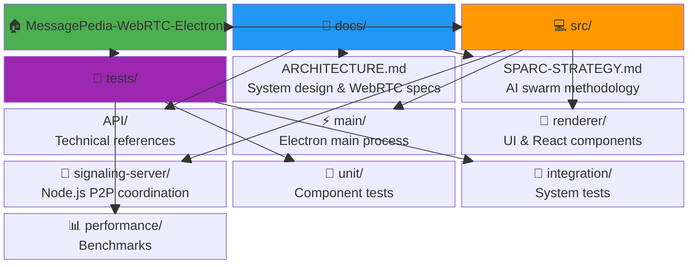
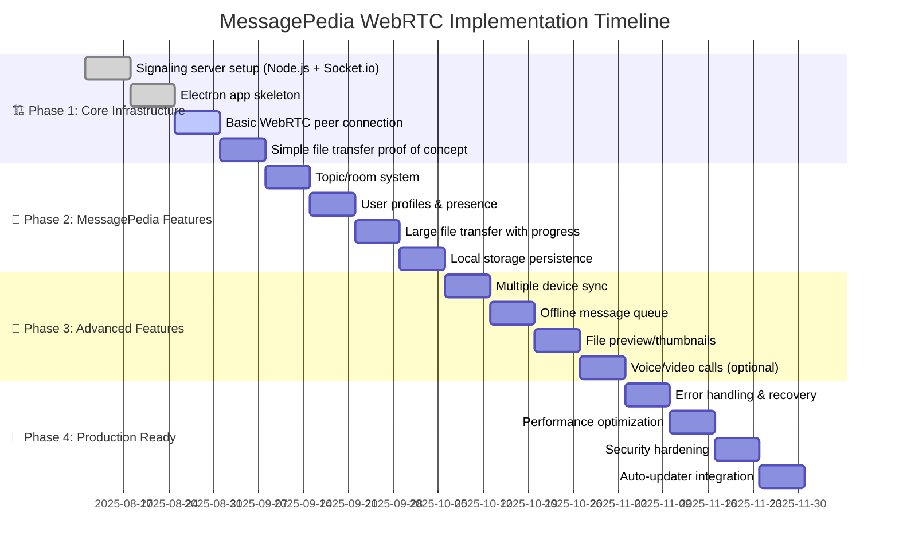

# MessagePedia WebRTC + Electron

Modern WebRTC + Electron replacement for MessagePedia P2P messaging system, solving JXTA networking issues with reliable peer-to-peer communication and file distribution.

## 🎯 Project Overview

This project replaces the legacy JXTA-based MessagePedia implementation with a modern WebRTC + Electron architecture that eliminates the persistent 15-second connection timeout issues while providing superior P2P file distribution capabilities.

## 🏗️ Architecture

- **Frontend**: Electron (Chromium + Node.js)
- **P2P Communication**: WebRTC (messaging + file transfer)  
- **Signaling Server**: Node.js + Socket.io (lightweight)
- **Language**: JavaScript/TypeScript
- **Packaging**: Cross-platform desktop app

## 🚀 Key Features

- ✅ **Eliminates JXTA timeout issues** with reliable WebRTC connections
- ✅ **Superior file distribution** with chunked P2P transfers
- ✅ **Cross-platform native** desktop app experience
- ✅ **Modern, maintainable** technology stack
- ✅ **Automatic NAT traversal** for corporate networks

## 📁 Project Structure



## 🔧 Development Setup

```bash
# Clone repository
git clone https://github.com/YOUR_USERNAME/MessagePedia-WebRTC-Electron.git
cd MessagePedia-WebRTC-Electron

# Install dependencies
npm install

# Start development
npm run dev
```

## 📊 Performance Targets

- **Connection establishment**: <2 seconds (vs. JXTA's 15+ second failures)
- **File transfer speed**: >50MB/s on local network  
- **Memory usage**: <200MB Electron app footprint
- **Cross-platform**: Windows 10+, macOS 10.15+, Ubuntu 20+

## 🛠️ Development Methodology

This project uses the **SPARC methodology** enhanced by AI swarm collaboration:
- **S**pecification: Comprehensive requirements analysis
- **P**seudocode: Algorithm design and data structures
- **A**rchitecture: System design and component interactions
- **R**efinement: Continuous optimization and improvement
- **C**ompletion: Testing, documentation, and deployment

## 📋 Implementation Roadmap



### 📊 Current Status
- **✅ Phase 1**: 75% Complete (WebRTC connection in progress)
- **🔄 Phase 2**: Planning stage
- **📋 Phase 3**: Requirements gathering
- **🎯 Phase 4**: Architecture design

## 📚 Documentation

### **Core Architecture & Strategy**
- [🏗️ Architecture Overview](docs/ARCHITECTURE.md) - System design with Mermaid visualizations
- [🤖 SPARC Implementation Strategy](docs/SPARC-STRATEGY.md) - AI swarm methodology with state diagrams
- [📊 Performance Analysis](docs/PERFORMANCE-ANALYSIS.md) - JXTA vs WebRTC metrics with charts
- [🔗 WebRTC Connection Flow](docs/WEBRTC-CONNECTION-FLOW.md) - Detailed P2P communication flows
- [🔐 Authentication Strategy](docs/AUTHENTICATION-STRATEGY.md) - Sign in with Apple OAuth integration

### **Visual Documentation Features**
- **📈 Interactive Diagrams**: Gantt charts, flowcharts, sequence diagrams  
- **🎯 Performance Metrics**: XY charts, quadrant analysis, success rate tracking
- **🏛️ System Architecture**: Component diagrams, topology visualizations
- **⚡ Real-time Workflows**: State machines, timeline tracking, process flows

### **Authentication & Security**
- **🍎 Sign in with Apple**: Privacy-focused OAuth 2.0 authentication
- **🔒 Secure Storage**: Electron safeStorage for credential protection
- **🛡️ JWT Validation**: Apple identity token verification
- **🔐 End-to-End Encryption**: DTLS for all WebRTC communications

### **Coming Soon**
- [API Documentation](docs/api/) - Interactive API reference
- [Deployment Guide](docs/deployment/) - Production deployment strategies
- [Testing Framework](docs/testing/) - Automated testing documentation
- [Security Analysis](docs/security/) - Comprehensive security assessment

## 🤝 Contributing

This project represents cutting-edge AI-assisted development using specialized agent collaboration. Contributions welcome!

## 📄 License

[License TBD]

## 🔗 Related Projects

- **Original MessagePedia**: JXTA-based P2P messaging system
- **WebTorrent Desktop**: Reference implementation for WebRTC P2P file sharing
- **Discord/Slack**: Examples of Electron-based communication apps

---

**🚀 This project demonstrates the future of AI-assisted software development.**
