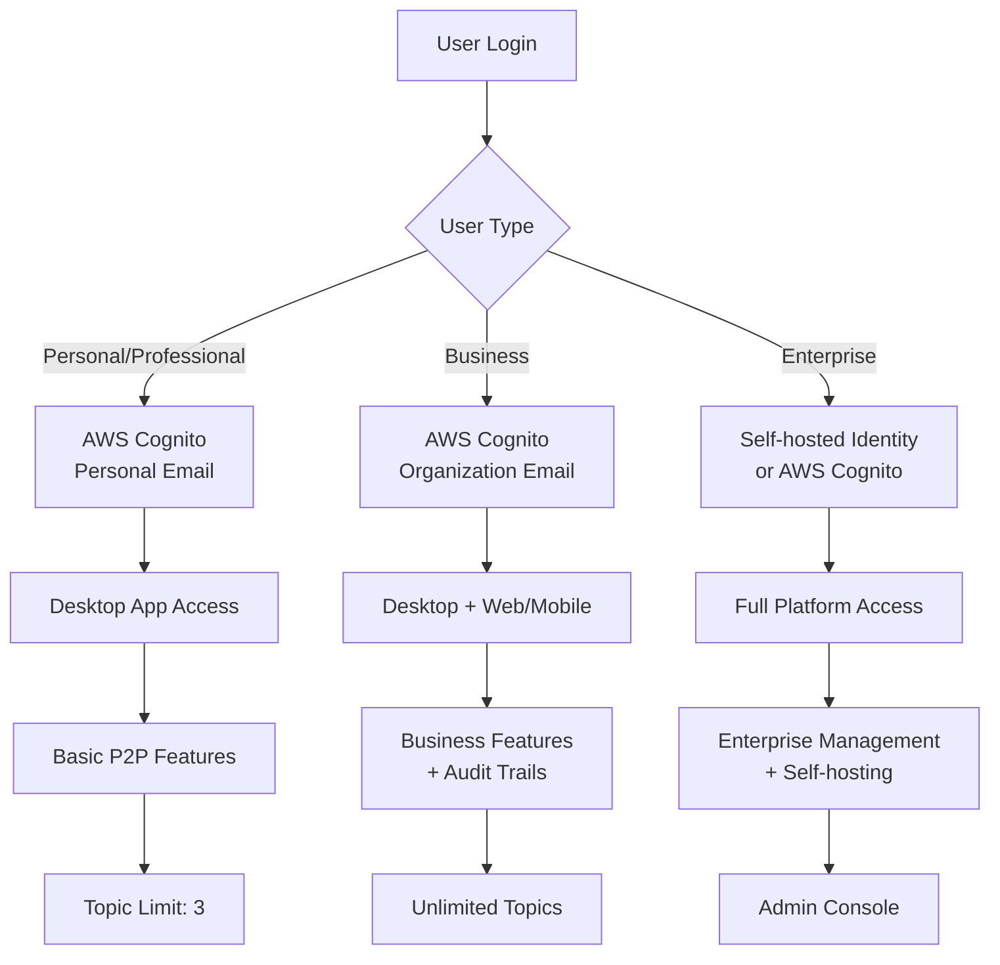
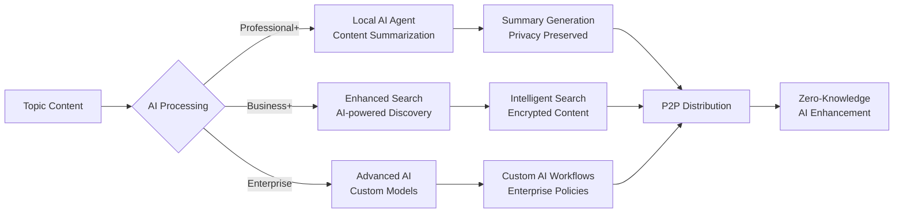
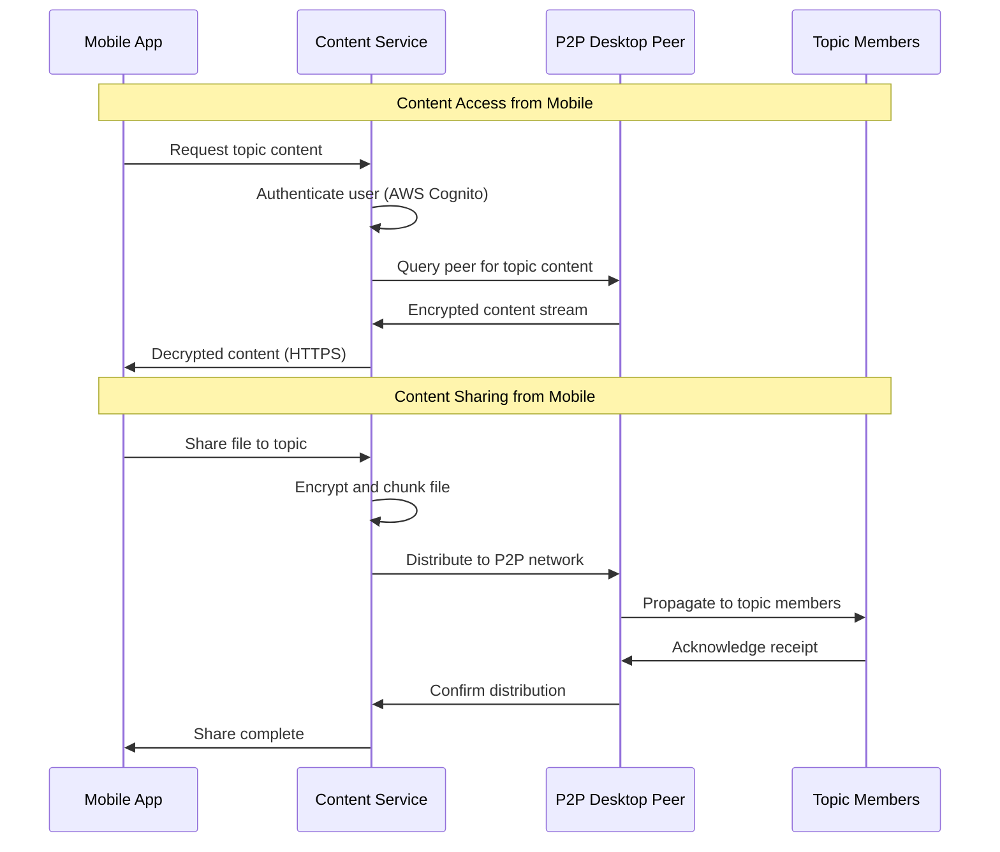
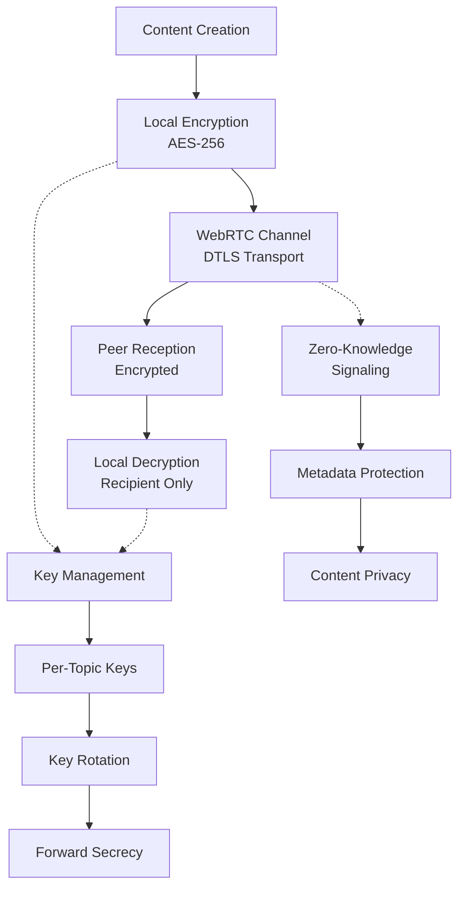
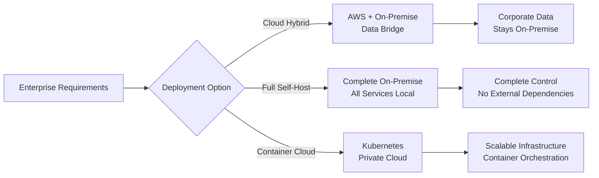

# MessagePedia - The Collective Intelligence App: Architecture

**Date**: 2025-08-20  
**Purpose**: Multi-tier decentralized content collaboration platform architecture  
**Context**: Comprehensive system design for Personal/Professional/Business/Enterprise tiers

## Executive Summary

MessagePedia is a next-generation decentralized content collaboration platform that enables powerful ideas and productivity to emerge from collaboration, expertise, and competition of ideas from teams — enhanced by AI — while adhering to data privacy and sovereignty laws.

## Multi-Tier Product Architecture

### Product Offering Matrix

| Feature | Personal (FREE) | Professional ($6/$60) | Business ($12/$120) | Enterprise (CALL) |
|---------|-----------------|----------------------|-------------------|------------------|
| **Core Features** |
| File Sharing with Unshare | ✅ | ✅ | ✅ | ✅ |
| Messaging with Recall | ✅ | ✅ | ✅ | ✅ |
| Role-based Access Control | ✅ | ✅ | ✅ | ✅ |
| File Versioning | ✅ | ✅ | ✅ | ✅ |
| End-to-End Encryption | ✅ | ✅ | ✅ | ✅ |
| Search (Messages and meta-data) | ✅ | ✅ | ✅ | ✅ |
| UNLIMITED File Size, Storage, Time | ✅ | ✅ | ✅ | ✅ |
| Desktop Access (Mac/Windows/Linux) | ✅ | ✅ | ✅ | ✅ |
| **Tier-Specific Features** |
| Topic Membership | Unlimited | Unlimited | Unlimited | Unlimited |
| Topic Ownership | 3 Topics | Unlimited | Unlimited | Unlimited |
| AI Agent (Content Summarization) | ❌ | ✅ | ✅ | ✅ |
| Audit Trail | ❌ | ❌ | ✅ | ✅ |
| Web/Mobile Access | ❌ | ❌ | ✅ | ✅ |
| Customer Self-hosting | ❌ | ❌ | ❌ | ✅ |
| Admin Console | ❌ | ❌ | ❌ | ✅ |
| **Target Users** | All | Prosumers | Teams/SMBs | Enterprises |

## System Architecture Overview

### Decentralized Content Services Platform


## Core Technology Stack

### Universal Components (All Tiers)
- **P2P Foundation**: WebRTC for direct peer connections
- **Authentication**: AWS Cognito user management
- **Encryption**: End-to-end encryption for all content
- **Desktop**: Electron applications (Mac/Windows/Linux)
- **Database**: SQLite for local storage
- **Signaling**: Rendezvous/Relay services for connection establishment

### Tier-Specific Components

#### Professional+ Tiers
- **AI Processing**: Local content summarization (Professional+)
- **Search Enhancement**: AI-powered content discovery

#### Business+ Tiers  
- **Web/Mobile Access**: Content Service bridges P2P to web/mobile
- **Audit System**: Compliance tracking and reporting
- **Multi-platform**: iOS/Android/Web applications

#### Enterprise Tier
- **Self-hosting**: Containerized deployment options
- **Admin Console**: User, content, and policy management
- **Federation**: Cross-organization collaboration

## Technical Architecture Details

### 1. P2P Messaging Foundation

```mermaid
sequenceDiagram
    participant A as Alice (Peer A)
    participant R as Rendezvous Service
    participant B as Bob (Peer B)
    
    Note over A,B: Peer Discovery
    A->>R: Register peer with AWS Cognito identity
    B->>R: Register peer with AWS Cognito identity
    R->>A: Notify: Bob available for P2P
    R->>B: Notify: Alice available for P2P
    
    Note over A,B: WebRTC Connection
    A->>R: Send WebRTC offer to Bob
    R->>B: Forward offer
    B->>R: Send WebRTC answer
    R->>A: Forward answer
    
    Note over A,B: ICE Negotiation
    A<-->R: Exchange ICE candidates
    R<-->B: Forward ICE candidates
    
    Note over A,B: Direct P2P Established
    A<-->B: Direct encrypted WebRTC connection
    A<-->B: Topic-based messaging
    A<-->B: File sharing with versioning
```

### 2. Multi-Tier Authentication



### 3. Topics: P2P Workspaces


### 4. AI Integration Architecture



### 5. Web/Mobile Bridge Architecture (Business+ Tiers)



## Enterprise Self-Hosting Architecture

### Containerized Deployment


## Data Architecture

### SQLite Schema (All Tiers)

```sql
-- Core P2P Tables
CREATE TABLE peers (
    id TEXT PRIMARY KEY,
    display_name TEXT NOT NULL,
    email TEXT,
    tier TEXT CHECK(tier IN ('personal', 'professional', 'business', 'enterprise')),
    topic_limit INTEGER DEFAULT 3,
    is_online BOOLEAN DEFAULT FALSE,
    reputation_score INTEGER DEFAULT 100,
    created_at DATETIME DEFAULT CURRENT_TIMESTAMP
);

CREATE TABLE topics (
    id TEXT PRIMARY KEY,
    name TEXT NOT NULL,
    description TEXT,
    owner_id TEXT REFERENCES peers(id),
    is_private BOOLEAN DEFAULT TRUE,
    is_archived BOOLEAN DEFAULT FALSE,
    created_at DATETIME DEFAULT CURRENT_TIMESTAMP
);

CREATE TABLE topic_members (
    topic_id TEXT REFERENCES topics(id),
    peer_id TEXT REFERENCES peers(id),
    role TEXT CHECK(role IN ('owner', 'contributor', 'reviewer')),
    joined_at DATETIME DEFAULT CURRENT_TIMESTAMP,
    PRIMARY KEY (topic_id, peer_id)
);

-- Business+ Tier Tables
CREATE TABLE audit_logs (
    id INTEGER PRIMARY KEY AUTOINCREMENT,
    peer_id TEXT REFERENCES peers(id),
    topic_id TEXT REFERENCES topics(id),
    action TEXT NOT NULL,
    details TEXT,
    timestamp DATETIME DEFAULT CURRENT_TIMESTAMP
);

-- Enterprise Tier Tables  
CREATE TABLE admin_policies (
    id INTEGER PRIMARY KEY AUTOINCREMENT,
    policy_name TEXT NOT NULL,
    policy_data TEXT NOT NULL,
    applied_by TEXT REFERENCES peers(id),
    created_at DATETIME DEFAULT CURRENT_TIMESTAMP
);
```

## Security Architecture

### End-to-End Encryption (All Tiers)



## Performance Requirements

### Connection Performance
- **Peer Discovery**: <2 seconds via Rendezvous Service
- **WebRTC Establishment**: <3 seconds with ICE/STUN/TURN
- **File Transfer**: >50MB/s on local network, bandwidth-limited over internet
- **Topic Sync**: <1 second for message propagation

### Scalability Targets
- **Personal Tier**: Up to 3 owned topics, unlimited membership
- **Professional+ Tiers**: Unlimited topics, up to 1000 members per topic
- **Enterprise Tier**: Unlimited scale with self-hosting options

### Resource Usage
- **Desktop App**: <300MB RAM, <1GB disk for app
- **Mobile App**: <100MB RAM, <500MB disk
- **Enterprise Server**: Scalable based on user count and content volume

## Deployment Architecture

### Cloud Infrastructure (Managed Tiers)


### Self-Hosting Options (Enterprise)



## Development Considerations

### Technical Feasibility Analysis
1. **✅ WebRTC P2P**: Proven technology, handles NAT traversal
2. **✅ Multi-tier Features**: Feasible with conditional feature flags
3. **⚠️ Web/Mobile Bridge**: Complex but achievable with Content Service
4. **⚠️ Enterprise Self-hosting**: Requires containerization and deployment automation
5. **✅ AWS Integration**: Well-documented APIs and SDKs available

### Architecture Tensions Resolution
1. **P2P vs Web/Mobile**: Content Service acts as authenticated bridge
2. **Zero-knowledge vs Cognito**: Authentication separate from content encryption
3. **Freemium Limits**: Enforced at app level, verified by community/audit
4. **Self-hosting vs Managed**: Containerized deployment maintains feature parity

## Next Steps for P Phase

1. **Component Interface Design**: Define APIs between all architectural components
2. **Database Schema Refinement**: Complete multi-tier schema with migrations
3. **Authentication Flow Design**: Detailed AWS Cognito integration patterns
4. **Deployment Strategy**: Container specifications and cloud infrastructure
5. **Testing Strategy**: Multi-tier testing approach with different feature sets

---

**Architecture Status**: Comprehensive multi-tier platform design complete  
**Next Phase**: P (Planning) - Detailed implementation planning and component design