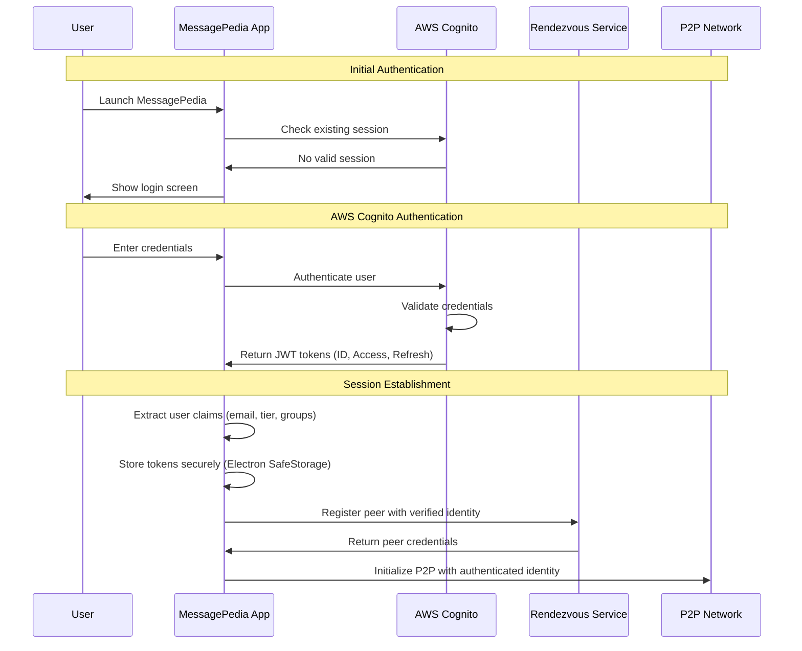
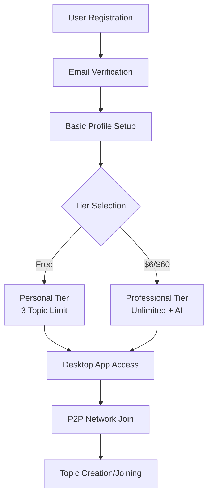
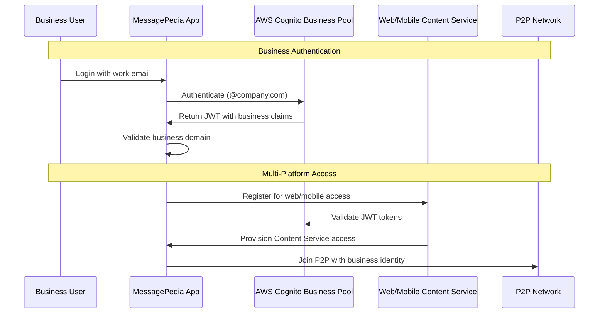
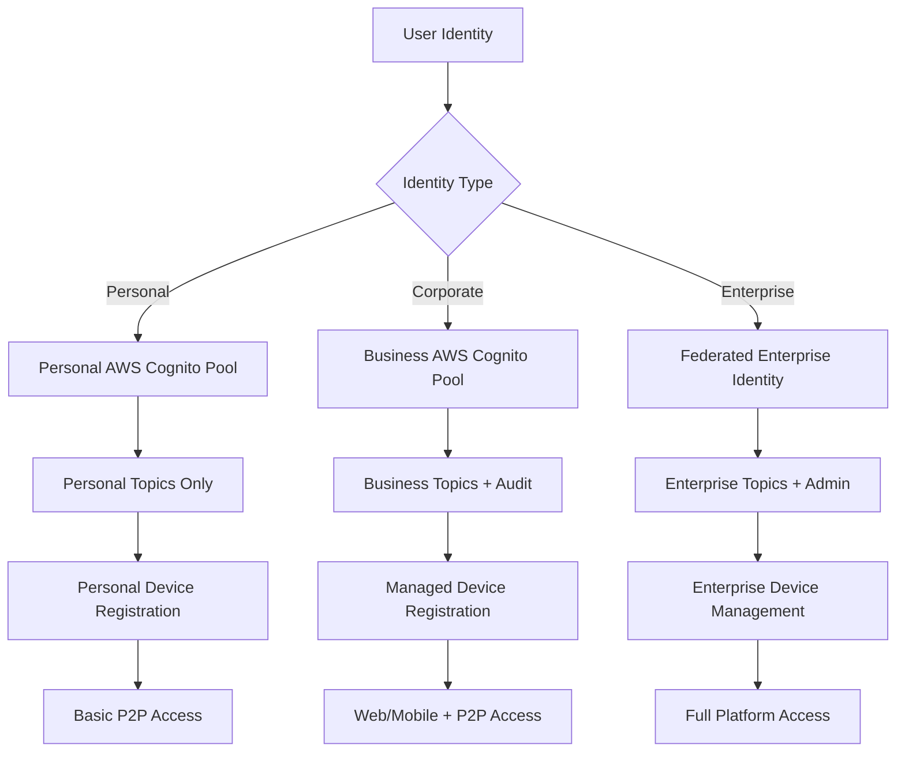
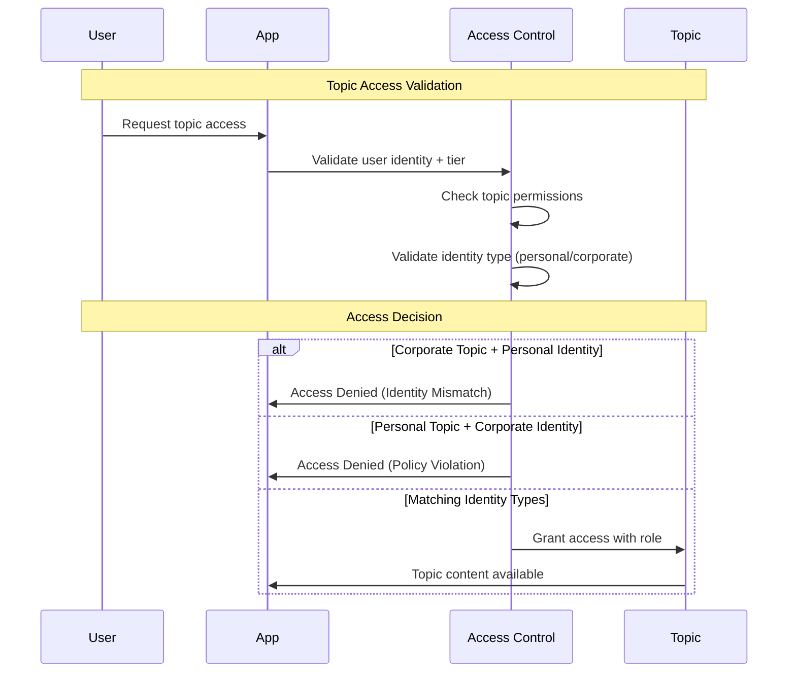
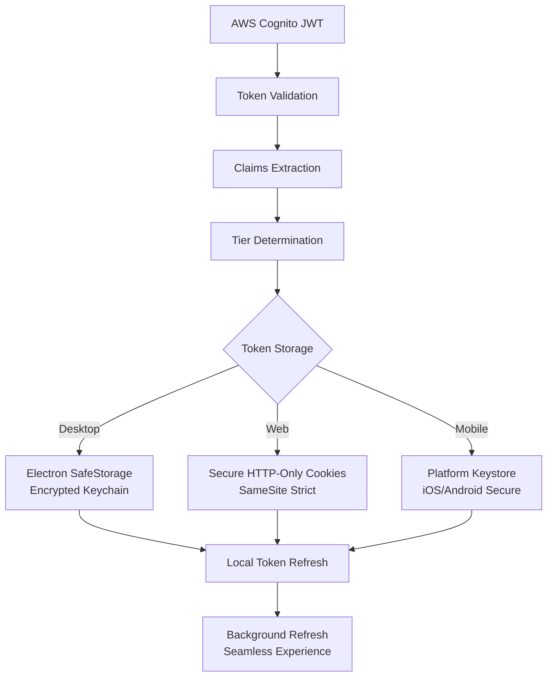
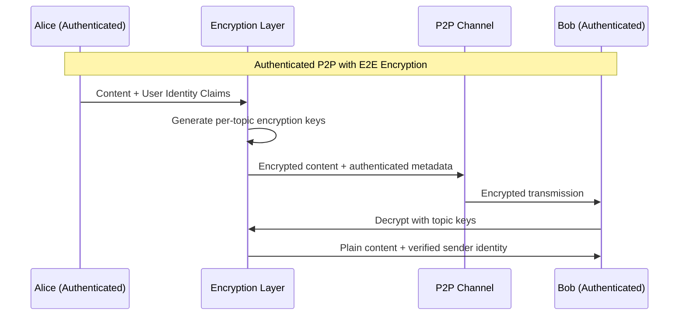
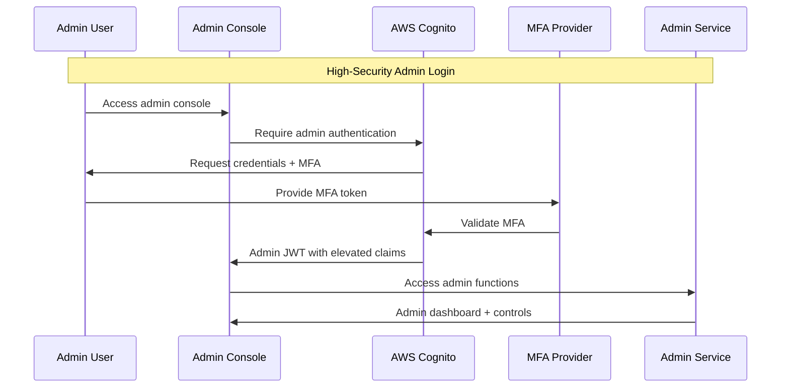
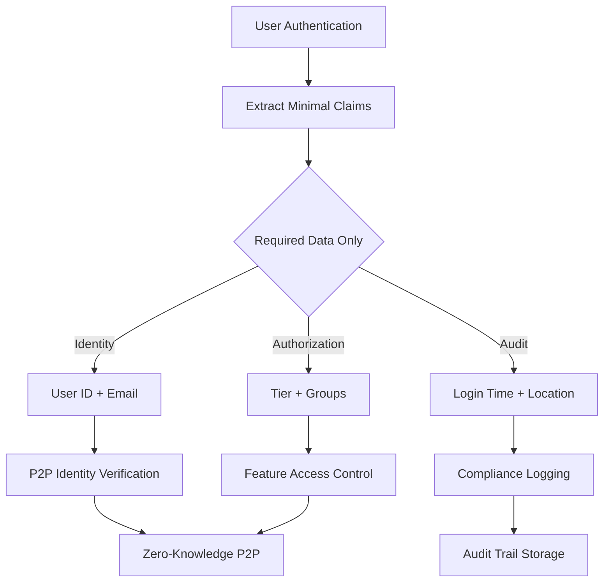

# MessagePedia Authentication Strategy

**Date**: 2025-08-20  
**Purpose**: Multi-tier authentication architecture for The Collective Intelligence App  
**Context**: AWS Cognito integration with enterprise identity management

## Executive Summary

MessagePedia implements a comprehensive authentication strategy using **AWS Cognito** as the primary identity provider, supporting multi-tier access control, enterprise integration, and self-hosting options. This approach balances security, scalability, and user experience across all product tiers.

## Multi-Tier Authentication Architecture

### Authentication by Tier

| Tier | Authentication Method | Identity Separation | Features |
|------|----------------------|-------------------|----------|
| **Personal (FREE)** | AWS Cognito Personal | Personal email | Basic P2P access |
| **Professional ($6/$60)** | AWS Cognito Personal | Personal email | Unlimited topics + AI |
| **Business ($12/$120)** | AWS Cognito Organization | Work email domains | Web/Mobile + Audit |
| **Enterprise (CALL)** | AWS Cognito + Self-hosted | SSO integration | Full control + Admin |

## AWS Cognito Integration Architecture

### Core Authentication Flow



### Multi-Tier User Pool Architecture


## Tier-Specific Authentication Details

### Personal & Professional Tiers

**Authentication Method**: AWS Cognito User Pool (Personal)



**User Attributes**:
```json
{
  "sub": "user-uuid",
  "email": "user@gmail.com",
  "email_verified": true,
  "custom:tier": "personal|professional",
  "custom:topic_limit": 3,
  "custom:features": ["p2p", "encryption", "ai_summary"],
  "cognito:groups": ["personal_users", "professional_users"]
}
```

### Business Tier

**Authentication Method**: AWS Cognito User Pool (Business)



**Business Domain Validation**:
```javascript
// Business tier domain validation
const businessDomains = [
  "company.com",
  "enterprise.org", 
  "business.net"
];

function validateBusinessEmail(email) {
  const domain = email.split('@')[1];
  return businessDomains.includes(domain);
}
```

### Enterprise Tier

**Authentication Method**: AWS Cognito + Enterprise SSO Federation


## Corporate vs Personal Identity Separation

### Identity Architecture



### Topic Access Control



## Security Implementation

### Token Management



### End-to-End Encryption Integration



## Enterprise Admin Console Authentication

### Admin Role Architecture


### Admin Authentication Flow



## Self-Hosting Authentication

### On-Premise Identity Integration


## Privacy and Compliance

### Data Minimization



### GDPR Compliance

- **Right to Access**: Export user authentication data
- **Right to Rectification**: Update user profile information
- **Right to Erasure**: Delete user accounts and associated data
- **Data Portability**: Export user data in machine-readable format
- **Consent Management**: Explicit consent for data processing

## Implementation Considerations

### Technical Requirements

1. **AWS Cognito Setup**: Multi-pool architecture for different tiers
2. **JWT Validation**: Secure token verification across all services
3. **Session Management**: Seamless token refresh and rotation
4. **MFA Integration**: Multi-factor authentication for enterprise tiers
5. **SSO Federation**: SAML/OIDC integration for enterprise customers

### Security Best Practices

1. **Token Security**: Short-lived access tokens, secure refresh tokens
2. **Transport Security**: TLS 1.3 for all authentication traffic
3. **Storage Security**: Platform-native secure storage for tokens
4. **Audit Logging**: Comprehensive authentication event logging
5. **Rate Limiting**: Protection against brute force attacks

## Next Steps for P Phase

1. **AWS Cognito Configuration**: Set up multi-tier user pools
2. **SDK Integration**: Implement AWS Cognito SDKs in Electron/Web/Mobile
3. **Token Management**: Secure storage and refresh mechanisms
4. **Admin Console**: Enterprise management interface development
5. **SSO Integration**: SAML/OIDC federation for enterprise customers

---

**Authentication Status**: Comprehensive multi-tier strategy defined  
**Next Phase**: P (Planning) - Detailed implementation planning and AWS setup