# MessagePedia Authentication Strategy

**Date**: 2025-08-11  
**Purpose**: Secure authentication implementation for WebRTC P2P messaging  
**Context**: Sign in with Apple integration and OAuth 2.0 flow documentation

## Executive Summary

MessagePedia implements secure authentication using **Sign in with Apple** as the primary method, providing fast, privacy-focused user verification with minimal data collection. This approach aligns with Apple's privacy guidelines while ensuring secure peer identity verification for P2P communications.

## Authentication Architecture

### **Sign in with Apple Flow**


### **Authentication Components**


## Implementation Details

### **Apple OAuth Configuration**

```javascript
// Apple Sign-In Configuration
const appleAuthConfig = {
  clientId: 'com.oboyle.messagepedia', // App Bundle ID
  redirectURI: 'https://messagepedia.oboyle.co/auth/callback',
  scope: 'email name', // Minimal data collection
  responseType: 'code',
  responseMode: 'form_post',
  state: generateSecureRandomState(),
  nonce: generateSecureNonce()
};

// Electron Implementation
const { shell } = require('electron');

async function signInWithApple() {
  const authURL = buildAppleAuthURL(appleAuthConfig);
  await shell.openExternal(authURL);
  
  // Handle deep link callback
  app.setAsDefaultProtocolClient('messagepedia');
}
```

### **JWT Token Validation**


### **Secure Credential Storage**

```javascript
const { safeStorage } = require('electron');

class SecureCredentialManager {
  constructor() {
    this.encryptionAvailable = safeStorage.isEncryptionAvailable();
  }

  async storeCredentials(credentials) {
    const data = JSON.stringify({
      accessToken: credentials.accessToken,
      refreshToken: credentials.refreshToken,
      idToken: credentials.idToken,
      expiresAt: credentials.expiresAt,
      userInfo: {
        email: credentials.email,
        name: credentials.name,
        appleId: credentials.sub
      }
    });

    if (this.encryptionAvailable) {
      const encrypted = safeStorage.encryptString(data);
      await this.saveToFile('credentials.enc', encrypted);
    } else {
      // Fallback: Basic encryption (development only)
      const encrypted = Buffer.from(data).toString('base64');
      await this.saveToFile('credentials.dat', encrypted);
    }
  }

  async retrieveCredentials() {
    try {
      if (this.encryptionAvailable) {
        const encrypted = await this.readFromFile('credentials.enc');
        const decrypted = safeStorage.decryptString(encrypted);
        return JSON.parse(decrypted);
      } else {
        const encoded = await this.readFromFile('credentials.dat');
        const decoded = Buffer.from(encoded, 'base64').toString();
        return JSON.parse(decoded);
      }
    } catch (error) {
      console.error('Failed to retrieve credentials:', error);
      return null;
    }
  }
}
```

## Peer Identity & Privacy

### **Privacy-First User Identity**


### **Peer ID Generation**

```javascript
const crypto = require('crypto');

class PeerIdentityManager {
  static generatePeerID(appleUserID, deviceInfo) {
    // Create deterministic but private peer ID
    const input = `${appleUserID}:${deviceInfo.hostname}:${Date.now()}`;
    const hash = crypto.createHash('sha256').update(input).digest('hex');
    
    return {
      peerID: `peer-${hash.substring(0, 16)}`,
      displayName: this.sanitizeDisplayName(deviceInfo.username),
      publicKey: this.generateKeyPair().publicKey,
      createdAt: new Date().toISOString(),
      verified: true // Apple-verified identity
    };
  }

  static sanitizeDisplayName(username) {
    // Remove potentially identifying information
    return username.replace(/[^a-zA-Z0-9\-_]/g, '').substring(0, 20);
  }
}
```

## Security Considerations

### **OAuth Security Best Practices**

```mermaid
quadrantChart
    title Authentication Security Assessment
    x-axis Low Security Risk --> High Security Risk
    y-axis Low Implementation Complexity --> High Implementation Complexity
    
    quadrant-1 High Security + Complex Implementation
    quadrant-2 High Security + Simple Implementation (Optimal)
    quadrant-3 Low Security + Simple Implementation
    quadrant-4 Low Security + Complex Implementation (Worst)
    
    Sign in with Apple: [0.9, 0.3]
    JWT Token Validation: [0.85, 0.4]
    Electron SafeStorage: [0.8, 0.2]
    
    Custom Auth System: [0.4, 0.9]
    Username/Password: [0.3, 0.6]
    Social Media OAuth: [0.6, 0.7]
```

#### **Security Measures Implemented**:

1. **PKCE Flow**: Proof Key for Code Exchange prevents authorization code interception
2. **State Parameter**: CSRF protection during OAuth flow
3. **Nonce Validation**: Replay attack prevention
4. **JWT Signature Verification**: Apple public key validation
5. **Secure Storage**: Electron's platform-native encryption
6. **Token Refresh**: Automatic credential renewal
7. **Revocation Support**: User can revoke access anytime

### **Threat Mitigation**

| Security Threat | Mitigation Strategy | Implementation |
|----------------|-------------------|----------------|
| **Token Interception** | HTTPS + certificate pinning | TLS 1.3 enforcement |
| **Credential Theft** | Encrypted local storage | Electron safeStorage |
| **Session Hijacking** | Short-lived tokens + refresh | 1-hour access token TTL |
| **CSRF Attacks** | State parameter validation | Cryptographic random state |
| **Replay Attacks** | Nonce + timestamp validation | JWT exp claim checking |
| **Man-in-Middle** | Certificate pinning | Apple certificate trust |

## User Experience Flow

### **Authentication Journey**


## Implementation Roadmap

### **Authentication Development Timeline**


## Testing Strategy

### **Authentication Test Coverage**

- [x] **OAuth Flow Testing**: Complete Apple Sign-In simulation
- [x] **JWT Validation**: Token signature and claims verification  
- [x] **Secure Storage**: Encryption/decryption validation
- [ ] **Error Handling**: Network failures, invalid tokens
- [ ] **Privacy Compliance**: Data collection audit
- [ ] **Cross-Platform**: macOS, Windows, Linux compatibility

### **Integration Testing**

```mermaid
flowchart LR
    A[Unit Tests<br/>🧪 OAuth Components] --> B[Integration Tests<br/>🔗 Full Auth Flow]
    B --> C[Security Tests<br/>🛡️ Penetration Testing]
    C --> D[Privacy Tests<br/>🔒 Data Collection Audit]
    D --> E[Performance Tests<br/>⚡ Token Operations]
    E --> F[Cross-Platform Tests<br/>💻 Multi-OS Validation]
    
    style A fill:#e3f2fd
    style F fill:#e8f5e8
```



## Conclusion

**Sign in with Apple** provides the optimal authentication solution for MessagePedia:

- **✅ Enhanced Privacy**: Minimal data collection with optional email hiding
- **✅ Superior Security**: Industry-standard OAuth 2.0 with Apple's security infrastructure  
- **✅ User Experience**: Fast, familiar authentication with biometric support
- **✅ Developer Benefits**: Reduced authentication complexity and compliance burden
- **✅ Cross-Platform**: Works across macOS, iOS, and web platforms

The implementation leverages Electron's native security features while maintaining compatibility with MessagePedia's P2P architecture, providing a secure foundation for decentralized messaging.

---

**References:**
- [Sign in with Apple Documentation](https://developer.apple.com/documentation/sign_in_with_apple)
- [OAuth 2.0 Security Best Practices](https://tools.ietf.org/html/draft-ietf-oauth-security-topics)
- [Electron Security Guidelines](https://www.electronjs.org/docs/latest/tutorial/security)