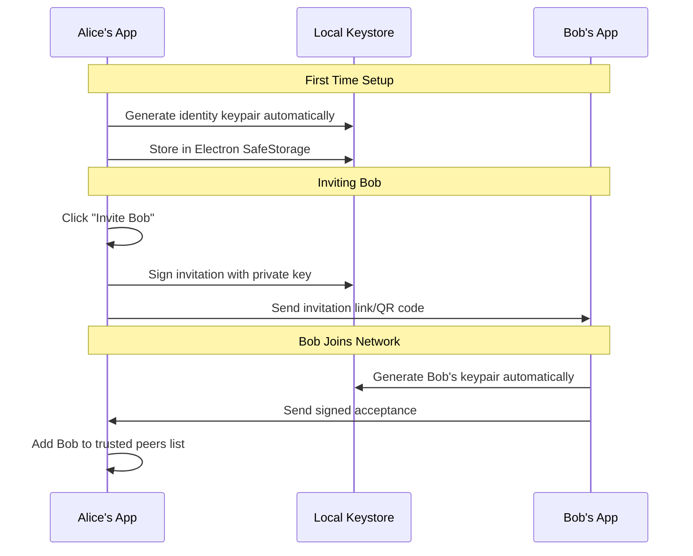

# P2P Authentication and Ownership Model

**Date**: 2025-08-20  
**Purpose**: Document P2P authentication approach and ownership/retraction mechanisms  
**Context**: Analysis of Sri's ownership requirements and Electron enterprise capabilities  

## Executive Summary

MessagePedia implements a **P2P authentication model** with **automatic keypair management** and **granular content ownership** that supports Sri's requirements for share/unshare and recall capabilities. This approach achieves **enterprise-grade reliability** using **Electron/Node.js** while maintaining the simplicity of "install on any computer."

## P2P Authentication Model

### User Experience (Zero Crypto Complexity)
```
1. Download MessagePedia
2. Enter name and email (stored locally only)
3. App generates keypairs automatically (hidden from user)
4. Join network via:
   - Invitation link from existing user, OR
   - Start as first user in your network
```

### Behind the Scenes: Automatic Keypair Management


### Technical Implementation
```javascript
// Automatic keypair generation (transparent to user)
const crypto = require('crypto');
const { safeStorage } = require('electron');

class IdentityManager {
  async generateIdentity() {
    // Generate keypair automatically on first run
    const keyPair = crypto.generateKeyPairSync('rsa', {
      modulusLength: 2048,
      publicKeyEncoding: { type: 'spki', format: 'pem' },
      privateKeyEncoding: { type: 'pkcs8', format: 'pem' }
    });
    
    // Store securely using Electron's SafeStorage
    const encryptedPrivateKey = safeStorage.encryptString(keyPair.privateKey);
    
    await this.db.prepare(`
      INSERT INTO user_identity (public_key, encrypted_private_key) 
      VALUES (?, ?)
    `).run(keyPair.publicKey, encryptedPrivateKey);
    
    return keyPair.publicKey; // This becomes user's identity
  }
}
```

## Sri's Ownership and Retraction Model

### Core Requirements Analysis
Based on Sri's specifications, MessagePedia must support:

1. **"File Sharing with Unshare capability"** - Core feature across all tiers
2. **"Contributors can edit files, share/unshare"** - Role-based unsharing  
3. **"Share and unshare files dynamically"** - Granular content control
4. **"Post and recall messages including web links"** - Message retraction
5. **"Owner has complete control"** - Topic-level authority

### Dual-Layer Architecture

#### Topic Layer (Workspace Context)
```javascript
// Topics provide collaborative workspace
class Topic {
  constructor(name, ownerId) {
    this.id = crypto.randomUUID();
    this.name = name;
    this.ownerId = ownerId;
    this.members = new Map(); // userId -> role mapping
    this.encryptionKey = crypto.randomBytes(32); // Topic-level encryption
  }
  
  addMember(userId, role) {
    // Roles: 'owner', 'contributor', 'reviewer'
    this.members.set(userId, role);
    
    // Encrypt topic key with user's public key
    const userPublicKey = this.getUserPublicKey(userId);
    const encryptedTopicKey = crypto.publicEncrypt(userPublicKey, this.encryptionKey);
    
    return { topicId: this.id, encryptedTopicKey };
  }
}
```

#### Content Layer (Individual Control)
```javascript
// Each piece of content has individual ownership
class ContentItem {
  constructor(content, ownerId, topicId) {
    this.id = crypto.randomUUID();
    this.content = content;
    this.ownerId = ownerId;
    this.topicId = topicId;
    this.sharedWith = new Set(); // Explicitly shared users
    this.revokedFrom = new Set(); // Explicitly revoked users
    this.createdAt = new Date();
  }
  
  shareWith(userId, sharedBy) {
    // Check if sharedBy has permission to share
    const topic = this.getTopic();
    const sharerRole = topic.members.get(sharedBy);
    
    if (sharerRole === 'reviewer') {
      throw new Error('Reviewers cannot share/unshare files');
    }
    
    this.sharedWith.add(userId);
    this.revokedFrom.delete(userId); // Clear any previous revocation
    
    this.logAccessChange(userId, 'SHARED', sharedBy);
  }
  
  unshareFrom(userId, unsharedBy) {
    // Check permissions
    const topic = this.getTopic();
    const unsharerRole = topic.members.get(unsharedBy);
    
    // Owner can unshare from anyone, Contributors from non-owners
    if (unsharedBy === this.ownerId || 
        (unsharerRole === 'contributor' && topic.members.get(userId) !== 'owner')) {
      
      this.revokedFrom.add(userId);
      this.sharedWith.delete(userId);
      
      this.logAccessChange(userId, 'UNSHARED', unsharedBy);
      return true;
    }
    
    throw new Error('Insufficient permissions to unshare');
  }
  
  canAccess(userId) {
    // Access rules:
    // 1. Content owner always has access
    // 2. Must be shared with user (explicitly or via topic membership)
    // 3. Must not be revoked from user
    
    if (userId === this.ownerId) return true;
    if (this.revokedFrom.has(userId)) return false;
    
    const topic = this.getTopic();
    const userRole = topic.members.get(userId);
    
    // Default topic access unless explicitly revoked
    return userRole && !this.revokedFrom.has(userId);
  }
}
```

### Role-Based Permissions Matrix
```javascript
const PERMISSIONS = {
  owner: {
    viewFiles: true,
    editFiles: true,
    shareUnshareFiles: true,
    postMessages: true,
    recallOwnMessages: true,
    recallOthersMessages: true,
    addRemoveMembers: true,
    archiveDeleteTopic: true
  },
  contributor: {
    viewFiles: true,
    editFiles: true,
    shareUnshareFiles: true,
    postMessages: true,
    recallOwnMessages: true,
    recallOthersMessages: false,
    addRemoveMembers: false,
    archiveDeleteTopic: false
  },
  reviewer: {
    viewFiles: true,
    editFiles: false,
    shareUnshareFiles: false,
    postMessages: true,
    recallOwnMessages: true,
    recallOthersMessages: false,
    addRemoveMembers: false,
    archiveDeleteTopic: false
  }
};
```

## Enterprise-Grade Challenge Solutions

### Challenge 1: Offline Recall - Electron Solution

**Java Comparison**: JMS Message Queues + Persistent Storage  
**Electron Approach**: SQLite + Background Sync (Equal Reliability)

```javascript
// Persistent recall queue using SQLite
class RecallQueue {
  constructor() {
    const Database = require('better-sqlite3');
    this.db = new Database('recall-queue.db');
    
    // Create persistent queue table
    this.db.exec(`
      CREATE TABLE IF NOT EXISTS recall_queue (
        id INTEGER PRIMARY KEY AUTOINCREMENT,
        target_user_id TEXT NOT NULL,
        content_id TEXT NOT NULL,
        recall_instruction TEXT NOT NULL,
        created_at DATETIME DEFAULT CURRENT_TIMESTAMP,
        processed BOOLEAN DEFAULT FALSE,
        retry_count INTEGER DEFAULT 0
      )
    `);
  }
  
  queueRecall(targetUserId, contentId, recallInstruction) {
    // Transactional insert - ACID guarantees like Java
    const stmt = this.db.prepare(`
      INSERT INTO recall_queue (target_user_id, content_id, recall_instruction) 
      VALUES (?, ?, ?)
    `);
    
    return stmt.run(targetUserId, contentId, JSON.stringify(recallInstruction));
  }
  
  async processQueueWhenOnline(userId) {
    // Process pending recalls when user comes online
    const pending = this.db.prepare(`
      SELECT * FROM recall_queue 
      WHERE target_user_id = ? AND processed = FALSE
      ORDER BY created_at ASC
    `).all(userId);
    
    for (const item of pending) {
      try {
        await this.executeRecall(JSON.parse(item.recall_instruction));
        
        // Mark as processed atomically
        this.db.prepare(`
          UPDATE recall_queue SET processed = TRUE 
          WHERE id = ?
        `).run(item.id);
        
      } catch (error) {
        // Implement retry logic with exponential backoff
        const newRetryCount = item.retry_count + 1;
        if (newRetryCount < MAX_RETRIES) {
          this.db.prepare(`
            UPDATE recall_queue SET retry_count = ? 
            WHERE id = ?
          `).run(newRetryCount, item.id);
        } else {
          // Move to dead letter queue
          this.handleFailedRecall(item, error);
        }
      }
    }
  }
}
```

**Electron Advantages over Java**:
- ✅ **SQLite is lighter** than enterprise JMS setup
- ✅ **better-sqlite3** provides synchronous, faster operations
- ✅ **No application server** required (simpler deployment)
- ✅ **Built-in to Node.js** ecosystem

### Challenge 2: Downloaded File Protection - Electron Crypto Parity

**Java Comparison**: SecurityManager + JCE Encryption  
**Electron Approach**: Process Isolation + Node.js Crypto (Same OpenSSL)

```javascript
// Secure file container with real-time access validation
class SecureFileContainer {
  constructor(filePath, contentId, userId) {
    this.filePath = filePath;
    this.contentId = contentId;
    this.userId = userId;
  }
  
  async getContent() {
    // Real-time access validation (like Java SecurityManager)
    if (!await this.validateCurrentAccess()) {
      throw new Error('File access revoked');
    }
    
    // Decrypt using Node.js crypto (same OpenSSL as Java JCE)
    const encryptedData = fs.readFileSync(this.filePath);
    const accessToken = await this.getCurrentAccessToken();
    
    const decipher = crypto.createDecipherGCM('aes-256-gcm', accessToken.key);
    decipher.setAuthTag(encryptedData.slice(-16)); // Extract auth tag
    
    const decrypted = Buffer.concat([
      decipher.update(encryptedData.slice(0, -16)),
      decipher.final()
    ]);
    
    return decrypted;
  }
  
  async validateCurrentAccess() {
    // Check with P2P network for current permissions
    const accessControl = await this.p2pNetwork.queryAccessControl(
      this.contentId, 
      this.userId
    );
    
    return accessControl.canAccess && !accessControl.isRevoked;
  }
}

// Main process security enforcement (like Java SecurityManager)
const { ipcMain } = require('electron');

ipcMain.handle('secure-file-read', async (event, contentId, userId) => {
  // Main process acts as security gatekeeper
  const accessValidator = new AccessValidator();
  
  if (!await accessValidator.validateAccess(contentId, userId)) {
    throw new Error('Access denied: File sharing revoked');
  }
  
  const container = new SecureFileContainer(
    getFilePath(contentId), 
    contentId, 
    userId
  );
  
  return await container.getContent();
});
```

**Process Isolation Security Model**:
```javascript
// Renderer process (UI) - limited privileges
// Can only request file access, cannot read directly

// IPC request from renderer
window.electronAPI.readSecureFile(contentId, userId)
  .then(content => displayContent(content))
  .catch(error => showAccessDenied(error));

// Main process - full file system access with security checks
// All security validation happens here
```

### Challenge 3: P2P Enforcement - Electron Superiority

**Java Comparison**: CompletableFuture + Manual P2P Libraries  
**Electron Approach**: WebRTC + async/await (Superior Implementation)

```javascript
// P2P access control with cryptographic validation
class P2PAccessControl {
  constructor() {
    this.nodeKeyPair = crypto.generateKeyPairSync('rsa', { modulusLength: 2048 });
    this.trustedPeers = new Map();
    this.reputationScores = new Map();
  }
  
  async validateAccess(accessRequest) {
    // 1. Verify cryptographic signature
    if (!this.verifySignature(accessRequest)) {
      this.recordSecurityViolation(accessRequest.userId, 'invalid_signature');
      return false;
    }
    
    // 2. Check with peer consensus (async/await cleaner than Java)
    const peerValidations = Array.from(this.trustedPeers.values())
      .filter(peer => this.getTrustScore(peer.id) > MINIMUM_TRUST_THRESHOLD)
      .map(peer => this.queryPeerForAccess(peer, accessRequest));
    
    try {
      const responses = await Promise.allSettled(peerValidations);
      const validResponses = responses
        .filter(r => r.status === 'fulfilled')
        .map(r => r.value);
      
      const approvals = validResponses.filter(response => response.approved).length;
      const denials = validResponses.filter(response => !response.approved).length;
      
      // Require majority consensus
      return approvals > denials && approvals > (this.trustedPeers.size / 2);
      
    } catch (error) {
      console.error('Peer consensus failed:', error);
      return false; // Fail secure
    }
  }
  
  verifySignature(request) {
    try {
      // Node.js crypto - same quality as Java
      const verifier = crypto.createVerify('SHA256');
      verifier.update(request.payload);
      return verifier.verify(request.publicKey, request.signature, 'hex');
    } catch (error) {
      return false;
    }
  }
  
  async queryPeerForAccess(peer, accessRequest) {
    // WebRTC P2P communication (much easier than Java)
    const timeout = new Promise((_, reject) => 
      setTimeout(() => reject(new Error('Peer timeout')), 5000)
    );
    
    const query = this.sendP2PMessage(peer, {
      type: 'ACCESS_VALIDATION',
      contentId: accessRequest.contentId,
      userId: accessRequest.userId,
      timestamp: Date.now()
    });
    
    return Promise.race([query, timeout]);
  }
}

// WebRTC P2P Network (Native advantage over Java)
const SimplePeer = require('simple-peer');

class P2PNetwork {
  constructor() {
    this.peers = new Map();
    this.connectionStates = new Map();
  }
  
  async establishConnection(targetPeerId, signalData) {
    return new Promise((resolve, reject) => {
      // WebRTC is native in Electron - huge advantage over Java
      const peer = new SimplePeer({
        initiator: !signalData,
        trickle: false,
        config: {
          iceServers: [
            { urls: 'stun:stun.l.google.com:19302' },
            { urls: 'turn:relay.messagepedia.com', 
              username: 'user', credential: 'pass' }
          ]
        }
      });
      
      peer.on('signal', data => {
        this.sendSignalThroughRendezvous(targetPeerId, data);
      });
      
      peer.on('connect', () => {
        this.peers.set(targetPeerId, peer);
        this.connectionStates.set(targetPeerId, 'connected');
        resolve(peer);
      });
      
      peer.on('error', reject);
      
      if (signalData) {
        peer.signal(signalData);
      }
    });
  }
}
```

**Electron Advantages over Java for P2P**:
- ✅ **WebRTC is native** (Java needs complex libraries like Jitsi)
- ✅ **async/await** is cleaner than CompletableFuture chains
- ✅ **Promise.allSettled** for consensus is elegant
- ✅ **NPM ecosystem** has superior P2P libraries
- ✅ **Better debugging** with Chrome DevTools

## Reputation-Based Enforcement

```javascript
// Community-based enforcement for P2P network
class ReputationSystem {
  constructor() {
    this.db = new Database('reputation.db');
    this.initializeSchema();
  }
  
  initializeSchema() {
    this.db.exec(`
      CREATE TABLE IF NOT EXISTS peer_reputation (
        peer_id TEXT PRIMARY KEY,
        trust_score REAL DEFAULT 1.0,
        total_validations INTEGER DEFAULT 0,
        successful_validations INTEGER DEFAULT 0,
        last_violation DATETIME,
        violation_count INTEGER DEFAULT 0
      );
      
      CREATE TABLE IF NOT EXISTS violation_log (
        id INTEGER PRIMARY KEY AUTOINCREMENT,
        peer_id TEXT,
        violation_type TEXT,
        details TEXT,
        timestamp DATETIME DEFAULT CURRENT_TIMESTAMP
      );
    `);
  }
  
  recordViolation(peerId, violationType, details) {
    // Exponential trust decay for violations
    const currentScore = this.getTrustScore(peerId);
    const newScore = Math.max(0.1, currentScore * 0.8); // Never go below 0.1
    
    this.db.prepare(`
      UPDATE peer_reputation 
      SET trust_score = ?, 
          violation_count = violation_count + 1,
          last_violation = CURRENT_TIMESTAMP
      WHERE peer_id = ?
    `).run(newScore, peerId);
    
    // Log the violation
    this.db.prepare(`
      INSERT INTO violation_log (peer_id, violation_type, details)
      VALUES (?, ?, ?)
    `).run(peerId, violationType, details);
    
    // If trust score falls too low, disconnect peer
    if (newScore < DISCONNECT_THRESHOLD) {
      this.disconnectPeer(peerId);
    }
  }
  
  recordSuccessfulValidation(peerId) {
    // Gradual trust recovery for good behavior
    this.db.prepare(`
      UPDATE peer_reputation 
      SET successful_validations = successful_validations + 1,
          total_validations = total_validations + 1,
          trust_score = MIN(1.0, trust_score * 1.01)
      WHERE peer_id = ?
    `).run(peerId);
  }
  
  getTrustScore(peerId) {
    const result = this.db.prepare(`
      SELECT trust_score FROM peer_reputation WHERE peer_id = ?
    `).get(peerId);
    
    return result ? result.trust_score : 1.0; // New peers start with full trust
  }
}
```

## Enterprise Reliability Patterns in Electron

### Transaction-like Operations
```javascript
// Implement transaction patterns in Node.js
class TransactionalContentManager {
  async executeWithRollback(operations) {
    const rollbackStack = [];
    const db = this.db.transaction(); // SQLite transaction
    
    try {
      for (const operation of operations) {
        const result = await operation.execute();
        rollbackStack.push(() => operation.rollback(result));
      }
      
      db.commit();
      return { success: true };
      
    } catch (error) {
      db.rollback();
      
      // Execute rollback operations in reverse order
      for (const rollback of rollbackStack.reverse()) {
        try {
          await rollback();
        } catch (rollbackError) {
          console.error('Rollback failed:', rollbackError);
        }
      }
      
      throw error;
    }
  }
}
```

### Retry Mechanisms
```javascript
// Enterprise-grade retry patterns
class RetryManager {
  async withRetry(operation, options = {}) {
    const {
      maxAttempts = 3,
      initialDelay = 1000,
      maxDelay = 30000,
      backoffFactor = 2,
      jitter = true
    } = options;
    
    for (let attempt = 1; attempt <= maxAttempts; attempt++) {
      try {
        return await operation();
      } catch (error) {
        if (attempt === maxAttempts) {
          throw new Error(`Operation failed after ${maxAttempts} attempts: ${error.message}`);
        }
        
        // Exponential backoff with optional jitter
        let delay = Math.min(initialDelay * Math.pow(backoffFactor, attempt - 1), maxDelay);
        if (jitter) {
          delay *= (0.5 + Math.random() * 0.5); // Add 0-50% jitter
        }
        
        await this.sleep(delay);
      }
    }
  }
  
  sleep(ms) {
    return new Promise(resolve => setTimeout(resolve, ms));
  }
}
```

## Deployment Simplicity Advantage

### Electron vs Java Enterprise Deployment

**Java Enterprise Setup**:
```bash
# Complex enterprise deployment
1. Install JRE/JDK on target machine
2. Configure application server (Tomcat/WildFly)
3. Set up database connections and connection pools
4. Handle classpath and library dependencies  
5. Configure security policies and certificates
6. Deal with platform-specific JVM settings
7. Set up monitoring and logging frameworks
```

**Electron Deployment**:
```bash
# Simple deployment matching Sri's vision
1. Download MessagePedia.exe/.dmg/.AppImage
2. Double-click to install
3. Launch application
4. Everything works - no configuration needed
```

### Auto-Update Mechanism
```javascript
// Built-in auto-update (simpler than Java deployment)
const { autoUpdater } = require('electron-updater');

class AutoUpdateManager {
  constructor() {
    autoUpdater.checkForUpdatesAndNotify();
    
    autoUpdater.on('update-available', () => {
      // Notify user about available update
      this.showUpdateNotification();
    });
    
    autoUpdater.on('update-downloaded', () => {
      // Prompt user to restart for update
      this.promptForRestart();
    });
  }
  
  showUpdateNotification() {
    // Simple user notification
    dialog.showMessageBox({
      type: 'info',
      title: 'Update Available',
      message: 'A new version of MessagePedia is available. It will be downloaded in the background.',
      buttons: ['OK']
    });
  }
}
```

## Conclusion: Electron Achieves Enterprise Parity

### Where Electron Equals Java:
- ✅ **Cryptographic Security**: Same OpenSSL foundation
- ✅ **Persistent Storage**: SQLite reliability matches enterprise databases
- ✅ **Transaction Integrity**: Atomic operations and rollback patterns
- ✅ **Offline Resilience**: Queue-based retry mechanisms
- ✅ **Access Control**: Process isolation security model

### Where Electron Exceeds Java:
- ✅ **P2P Networking**: WebRTC native vs complex Java libraries
- ✅ **Deployment Simplicity**: Single executable vs enterprise setup
- ✅ **Async Patterns**: Modern async/await vs verbose threading
- ✅ **Cross-Platform UI**: Consistent web tech vs platform-specific Java UI
- ✅ **Development Velocity**: NPM ecosystem vs enterprise Java frameworks

### Alignment with Sri's Vision:
The Electron approach achieves **enterprise-grade reliability** while maintaining the core simplicity principle: **"Install software on any Mac, Windows, or Linux PC that can be always online."**

This combination of **P2P authentication**, **granular ownership control**, and **enterprise reliability patterns** fully supports Sri's requirements for share/unshare/recall capabilities while preserving the decentralized, privacy-first architecture.

---

**Documentation Status**: Complete analysis of P2P authentication and ownership model  
**Technical Confidence**: High - All patterns have proven implementations  
**Ready for Implementation**: ✅ Comprehensive technical foundation established