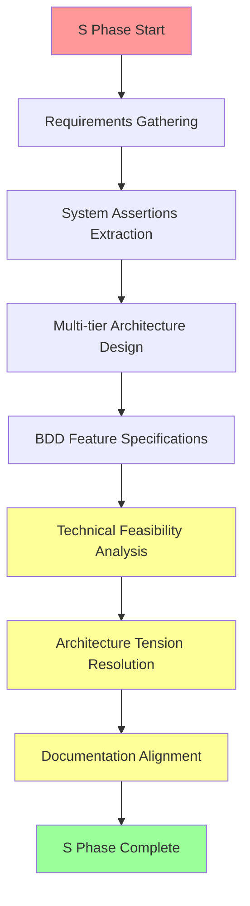
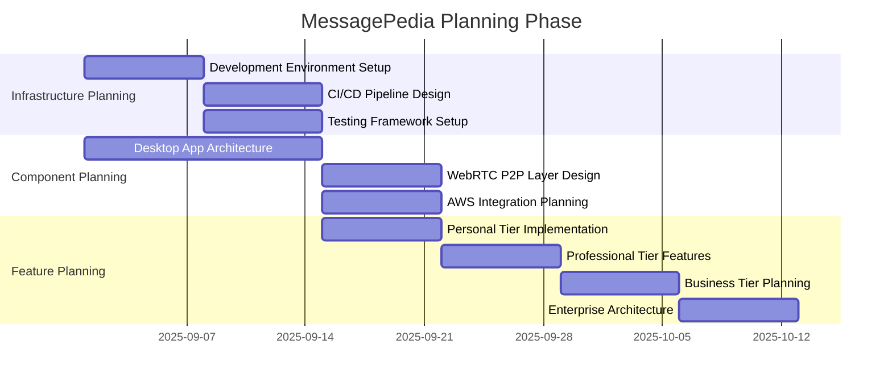
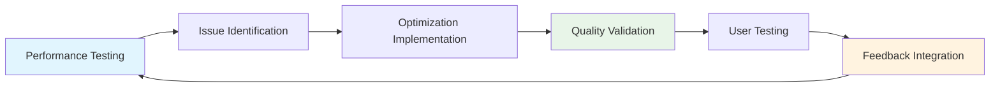
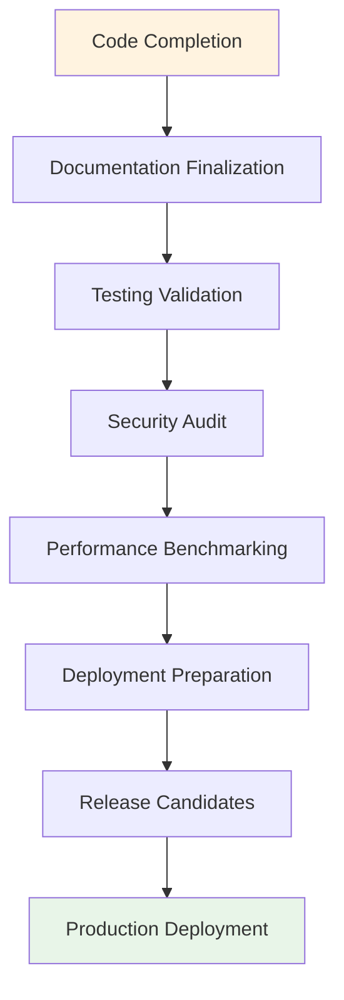
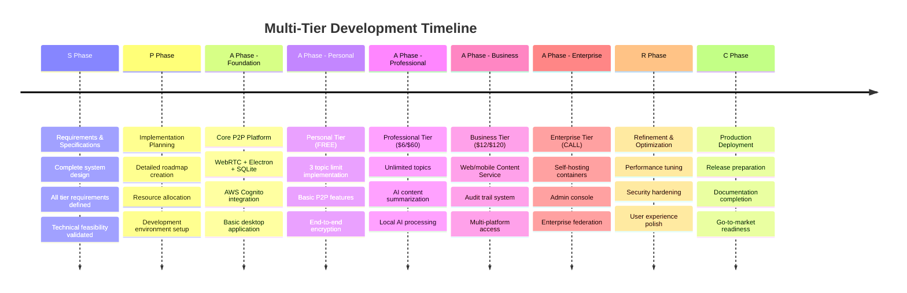
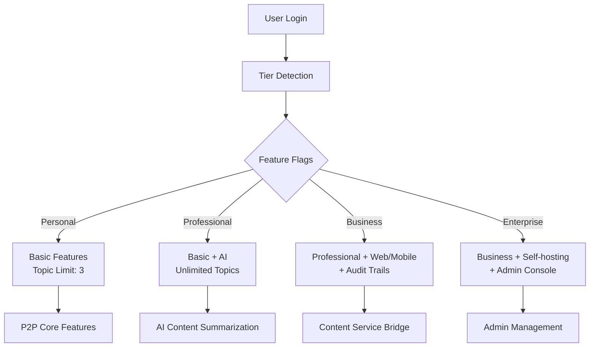

# MessagePedia SPARC Methodology Strategy

**Date**: 2025-08-20  
**Purpose**: SPARC methodology application for multi-tier MessagePedia development  
**Context**: Systematic development approach for The Collective Intelligence App

## Executive Summary

MessagePedia development follows the **SPARC methodology** - a systematic approach that ensures comprehensive specification before implementation. This document outlines how SPARC phases apply to our multi-tier decentralized content collaboration platform.

## SPARC Methodology Overview

### SPARC Framework
- **S**pecification: Comprehensive requirements analysis and system design
- **P**lanning: Detailed implementation roadmap and resource allocation  
- **A**rchitecture: Technical design and component development
- **R**efinement: Iterative improvement and optimization
- **C**ompletion: Testing, documentation, and deployment

## Current Phase Status

### S - Specification Phase (CURRENT)

**Status**: In Progress - Finalizing comprehensive specifications

**Completed Work**:
- ✅ **System Assertions**: Complete requirements extracted from vision documents
- ✅ **Multi-tier Architecture**: 4-tier product offering matrix defined
- ✅ **BDD Feature Files**: Comprehensive behavioral specifications
- ✅ **Technical Architecture**: Platform design with all tiers
- ✅ **Target Market Analysis**: User personas and pricing strategy

**Remaining S Phase Work**:
- ⏳ **Technical Feasibility Validation**: Ensure all assertions are implementable
- ⏳ **Architecture Tension Resolution**: Resolve conflicts between requirements
- ⏳ **API Design**: Define interfaces between components
- ⏳ **Complete Documentation Alignment**: Finalize all specification documents

## SPARC Phase Details

### S Phase: Specification (Weeks 1-4)

**Week 1-2: Requirements Analysis**
- Extract comprehensive requirements from vision documents
- Define multi-tier product offering matrix
- Identify target users and use cases
- Create system assertions document

**Week 3: Technical Architecture**
- Design decentralized content services platform
- Define component interactions and data flows
- Specify security and encryption requirements
- Create deployment architecture options

**Week 4: Specification Finalization**
- Validate technical feasibility of all requirements
- Resolve architectural tensions and conflicts
- Complete API interface definitions
- Finalize all documentation for consistency

### P Phase: Planning (Weeks 5-8)

**Deliverables**:
- Detailed implementation roadmap
- Resource allocation and timeline
- Technology stack specifications
- Development environment setup
- Testing strategy and framework

### A Phase: Architecture (Weeks 9-16)

**Phase Breakdown**:
- **Weeks 9-10**: Core P2P foundation and desktop app
- **Weeks 11-12**: Authentication and Personal/Professional tiers
- **Weeks 13-14**: Business tier with web/mobile bridge
- **Weeks 15-16**: Enterprise tier and self-hosting capabilities

### R Phase: Refinement (Weeks 17-20)

**Iterative Improvement Cycle**:

**Focus Areas**:
- Performance optimization across all tiers
- Security hardening and vulnerability testing
- User experience refinement
- Cross-platform compatibility validation
- Enterprise deployment testing

### C Phase: Completion (Weeks 21-24)

**Delivery Pipeline**:

**Deliverables**:
- Production-ready applications for all tiers
- Comprehensive documentation (user + technical)
- Deployment packages and containers
- Security audit reports
- Performance benchmarks

## Multi-Tier Development Strategy

### Incremental Tier Development

### Feature Flag Strategy

## Risk Management Strategy

### Technical Risks

| Risk | Impact | Mitigation Strategy |
|------|--------|-------------------|
| **WebRTC Complexity** | High | Start with proven libraries, extensive testing |
| **Multi-tier Coordination** | Medium | Feature flags, incremental development |
| **AWS Integration** | Medium | Use well-documented SDKs, fallback options |
| **Enterprise Self-hosting** | High | Containerization, extensive documentation |
| **Content Service Bridge** | High | Prototype early, security-first approach |

### Development Risks

| Risk | Impact | Mitigation Strategy |
|------|--------|-------------------|
| **Scope Creep** | High | Strict SPARC phase gates |
| **Feature Complexity** | Medium | Incremental tier development |
| **Timeline Pressure** | Medium | Conservative estimates, buffer time |
| **Integration Issues** | High | Continuous integration, early testing |
| **Security Vulnerabilities** | Critical | Security-first development, regular audits |

## Quality Assurance Strategy

### Testing Approach

### Success Metrics

**Technical Metrics**:
- Code coverage >90% across all components
- Performance targets met for all tiers
- Security audit score >95%
- Cross-platform compatibility validated

**Product Metrics**:
- All BDD scenarios pass validation
- Multi-tier features work as specified
- Enterprise deployment successful
- User acceptance criteria met

## Conclusion

The SPARC methodology provides a systematic approach to developing MessagePedia's complex multi-tier platform. By following this structured approach, we ensure:

- **Comprehensive Specifications**: All requirements clearly defined
- **Systematic Development**: Incremental, validated progress
- **Quality Assurance**: Testing and validation at every phase
- **Risk Mitigation**: Identified risks with mitigation strategies
- **Successful Delivery**: Production-ready platform across all tiers

**Current Status**: S Phase nearing completion  
**Next Milestone**: Begin P Phase planning  
**Target Delivery**: 24-week comprehensive development cycle

---

**Methodology Status**: SPARC framework defined and ready for execution  
**Next Phase**: Complete S Phase and transition to P Phase planning