# MessagePedia: Claude Flow + SPARC Implementation Strategy

**Date**: 2025-08-06  
**Purpose**: Revolutionary AI-assisted development approach using swarm orchestration and systematic methodology  
**Context**: Building WebRTC + Electron MessagePedia replacement with cutting-edge AI development tools

## Executive Summary

Combining **Claude Flow's swarm orchestration** with **SPARC methodology** creates an unprecedented development approach where specialized AI agents collaborate systematically to build the WebRTC + Electron MessagePedia replacement. This represents the future of AI-assisted software development.

## Architecture: AI Swarm + Human Oversight

### **Swarm Topology**


### **Agent Specializations**

#### **WebRTC-Architecture-Specialist** (Architect)
- **Capabilities**: webrtc_design, p2p_networking, electron_architecture, sparc_methodology
- **Role**: System design, WebRTC connection patterns, NAT traversal strategies
- **SPARC Phase**: Architecture design and technical specifications

#### **SPARC-Implementation-Agent** (Coder)  
- **Capabilities**: sparc_framework, javascript_typescript, electron_development, webrtc_implementation
- **Role**: Code generation, SPARC methodology adherence, implementation quality
- **SPARC Phase**: Pseudocode → Implementation → Refinement

#### **P2P-Systems-Analyst** (Analyst)
- **Capabilities**: jxta_migration, p2p_protocols, performance_analysis, swarm_coordination  
- **Role**: JXTA issue analysis, performance optimization, system coordination
- **SPARC Phase**: Specification analysis and completion validation

## SPARC Framework Enhanced by AI Swarm

### **SPARC Workflow State Machine**

```mermaid
stateDiagram-v2
    [*] --> Specification
    
    state "S - Specification" as Specification {
        [*] --> RequirementAnalysis
        RequirementAnalysis --> JXTAIssueMapping
        JXTAIssueMapping --> TechnicalConstraints
        TechnicalConstraints --> AcceptanceCriteria
        AcceptanceCriteria --> [*]
        
        note right of RequirementAnalysis
            AI Analyst Agent:
            • Detailed JXTA analysis
            • WebRTC solution mapping
        end note
    }
    
    Specification --> Pseudocode : Specs Approved
    
    state "P - Pseudocode" as Pseudocode {
        [*] --> AlgorithmDesign
        AlgorithmDesign --> DataStructures
        DataStructures --> ComponentAPIs
        ComponentAPIs --> [*]
        
        note right of AlgorithmDesign
            AI Coder Agent:
            • WebRTC algorithms
            • P2P protocols
            • File transfer logic
        end note
    }
    
    Pseudocode --> Architecture : Code Design Complete
    
    state "A - Architecture" as Architecture {
        [*] --> SystemDesign
        SystemDesign --> ComponentInteractions
        ComponentInteractions --> IntegrationPoints
        IntegrationPoints --> [*]
        
        note right of SystemDesign
            AI Architect Agent:
            • Electron app structure
            • WebRTC components
            • System diagrams
        end note
    }
    
    Architecture --> Refinement : Architecture Approved
    
    state "R - Refinement" as Refinement {
        [*] --> PerformanceOptimization
        PerformanceOptimization --> CodeReview
        CodeReview --> TestingValidation
        TestingValidation --> BugFixes
        BugFixes --> [*]
        
        note right of PerformanceOptimization
            AI Swarm Collaboration:
            • Optimizer Agent
            • Reviewer Agent  
            • Tester Agent
        end note
    }
    
    Refinement --> Completion : Quality Gates Passed
    
    state "C - Completion" as Completion {
        [*] --> Documentation
        Documentation --> Packaging
        Packaging --> Deployment
        Deployment --> [*]
        
        note right of Documentation
            AI Delivery Pipeline:
            • Documentation Agent
            • Packaging Agent
            • Deployment Agent
        end note
    }
    
    Completion --> [*] : Project Delivered
    
    Refinement --> Architecture : Major Issues Found
    Architecture --> Pseudocode : Design Changes Needed
    Pseudocode --> Specification : Requirements Change
```



### **S - Specification (AI-Enhanced Requirements)**

**Human Input**: High-level MessagePedia requirements  
**AI Swarm Output**:
- **Analyst Agent**: Detailed JXTA issue analysis and WebRTC solution mapping
- **Architect Agent**: Technical constraints and system requirements  
- **Implementation Agent**: Development-ready specifications with acceptance criteria

**Deliverable**: Comprehensive specification document with:
```yaml
MessagePedia_Specifications:
  core_requirements:
    - P2P messaging with presence detection
    - Large file distribution (GB+ files)
    - Cross-platform desktop app (Windows/Mac/Linux)
    - NAT traversal (solve JXTA socket issues)
  
  technical_constraints:
    - WebRTC for P2P communication
    - Electron for desktop packaging
    - Node.js signaling server
    - Backward compatibility with MessagePedia concepts
  
  success_criteria:
    - Sub-2 second peer connection establishment
    - File transfer speeds >50MB/s on local network
    - Zero 15-second timeout failures
    - Runs on restrictive corporate networks
```

### **P - Pseudocode (AI-Generated Algorithms)**

**Swarm Collaboration**:
- **Architect**: High-level system flow and component interactions
- **Coder**: Detailed implementation algorithms and data structures
- **Analyst**: Performance optimization and edge case handling

**Example AI-Generated Pseudocode**:
```javascript
// WebRTC Peer Connection Manager
class PeerConnectionManager {
  async establishConnection(peerId, signalServer) {
    // 1. Initialize ICE candidates gathering
    // 2. Send offer through signaling server
    // 3. Handle answer and complete connection
    // 4. Setup data channels for messaging and files
    // 5. Implement connection monitoring and recovery
  }
  
  async transferFile(file, targetPeers) {
    // 1. Chunk file into 64KB segments
    // 2. Distribute chunks across multiple peers
    // 3. Implement progress tracking and error recovery
    // 4. Reassemble file on recipient side
  }
}
```

### **A - Architecture (Swarm-Designed System)**

**Multi-Agent Architecture Design**:
```
┌─────────────────────────────────────────┐
│            Electron App                 │
├─────────────────────────────────────────┤
│    React/Vue UI Layer                   │ ← UI Specialist Agent
├─────────────────────────────────────────┤  
│  WebRTC P2P Communication Layer        │ ← WebRTC Specialist Agent
├─────────────────────────────────────────┤
│   Message/File Management Layer        │ ← Data Management Agent
├─────────────────────────────────────────┤
│    Node.js System Integration          │ ← Systems Integration Agent
└─────────────────────────────────────────┘
```

**Agent-Designed Components**:
- **Connection Manager**: WebRTC peer discovery and management
- **Message Router**: Topic-based message distribution  
- **File Transfer Engine**: Chunked P2P file distribution
- **Presence Manager**: Real-time online/offline status
- **Storage Layer**: Local message/file persistence

### **R - Refinement (Continuous AI Optimization)**

**Swarm-Based Optimization Cycle**:
1. **Performance Analyst**: Monitor connection times, transfer speeds
2. **Code Reviewer**: Optimize algorithms and fix issues
3. **Test Agent**: Run automated test suites and report issues
4. **Optimization Agent**: Suggest and implement improvements

**Real-time Optimization**:
- **Connection performance**: Analyze and optimize ICE candidate selection
- **File transfer**: Adjust chunk sizes based on network conditions
- **Memory usage**: Electron app optimization for resource consumption
- **Error handling**: Improve connection recovery and edge case handling

### **C - Completion (AI-Assisted Delivery)**

**Swarm Delivery Pipeline**:
- **Documentation Agent**: Generate comprehensive user and technical docs
- **Testing Agent**: Complete test suite with automated validation
- **Packaging Agent**: Cross-platform Electron app building and distribution
- **Deployment Agent**: Signaling server deployment and configuration

## Development Workflow

### **Claude Flow + SPARC Development Timeline**


### **Phase 1: AI Swarm Setup (Week 1)**
```bash
# Initialize Claude Flow swarm with 12 agents
claude-flow swarm init --topology hierarchical --max-agents 12

# Spawn Tier 1: Core Development Agents
claude-flow agent spawn --type architect --name webrtc-specialist
claude-flow agent spawn --type coder --name electron-dev
claude-flow agent spawn --type analyst --name p2p-systems

# Spawn Tier 2: Quality Assurance Agents  
claude-flow agent spawn --type tester --name integration-testing
claude-flow agent spawn --type reviewer --name code-quality
claude-flow agent spawn --type optimizer --name performance-tuning

# Spawn Tier 3: Specialized Documentation Agents
claude-flow agent spawn --type specialist --name mermaid-visualizer
claude-flow agent spawn --type documenter --name technical-writer
claude-flow agent spawn --type specialist --name timeline-specialist
```

### **Phase 2: SPARC Specification (Week 2)**
**Multi-Agent Task Orchestration**:
```bash
claude-flow task orchestrate \
  "Generate comprehensive MessagePedia WebRTC+Electron specifications using SPARC methodology with Mermaid visualizations" \
  --strategy parallel --priority high --max-agents 6
```

**Expected AI-Generated Output**: 
- Complete technical specifications with Mermaid diagrams
- Architecture visualizations (Architecture, Sequence, Quadrant charts)
- Implementation roadmap with Gantt charts
- Testing strategies with flowcharts

### **Phase 3: Parallel Development (Weeks 3-8)**
**Swarm Coordination with Visualization**:
```bash
# UI Development with Documentation
claude-flow task orchestrate "Build Electron UI with React and generate component diagrams"

# WebRTC Implementation with Sequence Diagrams
claude-flow task orchestrate "Implement WebRTC peer connections with flow visualizations"

# File Transfer with Flowcharts
claude-flow task orchestrate "Build chunked file transfer with progress tracking diagrams"

# Signaling Server with Architecture Diagrams  
claude-flow task orchestrate "Create Node.js signaling server with system visualizations"
```

### **Phase 4: Integration & Refinement (Weeks 9-12)**
**AI Swarm Continuous Optimization**:
- **Performance Monitoring**: AI agents track connection times, transfer speeds
- **Quality Assurance**: Automated code review and testing validation
- **Documentation**: Real-time Mermaid diagram updates with code changes
- **Security Analysis**: AI vulnerability scanning and remediation

## Competitive Advantages

### **Development Speed**
- **10x faster development**: Multiple AI agents working in parallel
- **Continuous optimization**: Real-time performance improvement
- **Automated testing**: Comprehensive quality assurance
- **Instant documentation**: Always up-to-date technical docs

### **Quality Assurance**
- **Multi-agent code review**: Several AI perspectives on every component
- **Systematic testing**: SPARC methodology ensures comprehensive coverage
- **Performance optimization**: Continuous monitoring and improvement
- **Best practices enforcement**: AI agents trained on industry standards

### **Innovation Potential**
- **Novel P2P patterns**: AI exploration of optimal WebRTC architectures
- **Adaptive algorithms**: Self-optimizing connection and transfer strategies
- **Edge case handling**: AI identification and resolution of corner cases
- **Future-proof design**: Architecture optimized for emerging technologies

## Technical Implementation Details

### **Claude Flow Integration Points**

**Memory Management**:
```javascript
// Store project context across sessions
await claudeFlow.memory.store('messagepedia-context', {
  jxtaIssues: parsedLogAnalysis,
  webrtcRequirements: technicalSpecs,
  sparkPhase: 'Architecture',
  completedComponents: ['signaling-server', 'peer-manager']
});
```

**Task Orchestration**:
```javascript
// Coordinate multiple development streams
const parallelTasks = await claudeFlow.orchestrate({
  tasks: [
    'Implement WebRTC connection manager',
    'Build file transfer engine', 
    'Create Electron app wrapper',
    'Design UI components'
  ],
  strategy: 'parallel',
  agentAssignment: 'capability-matched'
});
```

### **SPARC Automation**

**Automated Phase Transitions**:
```javascript
class SPARCWorkflow {
  async executePhase(phase, requirements) {
    switch(phase) {
      case 'Specification':
        return await this.swarm.generateSpecs(requirements);
      case 'Pseudocode':
        return await this.swarm.designAlgorithms();
      case 'Architecture':
        return await this.swarm.createSystemDesign();
      case 'Refinement':
        return await this.swarm.optimizeImplementation();
      case 'Completion':
        return await this.swarm.packageDeliverable();
    }
  }
}
```

## Risk Mitigation

### **AI Coordination Risks**
- **Human oversight**: Regular checkpoints and validation
- **Rollback capability**: Version control of all AI-generated code  
- **Quality gates**: SPARC phase completion requires human approval
- **Fallback plan**: Traditional development if swarm coordination fails

### **Technical Risks**  
- **WebRTC complexity**: AI agents trained on WebRTC best practices
- **Cross-platform issues**: Automated testing on all target platforms
- **Performance bottlenecks**: Continuous monitoring and optimization
- **Security vulnerabilities**: AI-powered security analysis

## Success Metrics

### **Development Metrics**
- **Time to MVP**: Target 8 weeks vs. 16 weeks traditional development
- **Code quality**: Automated code review scores >90%
- **Test coverage**: >95% automated test coverage
- **Documentation**: Complete technical and user documentation

### **Technical Performance**
- **Connection establishment**: <2 seconds (vs. JXTA's 15+ second failures)
- **File transfer speed**: >50MB/s on local network
- **Memory usage**: <200MB Electron app footprint
- **Cross-platform compatibility**: Works on Windows 10+, macOS 10.15+, Ubuntu 20+

## Conclusion

**Claude Flow + SPARC represents the future of AI-assisted development**: systematic methodology enhanced by specialized AI agent collaboration. This approach not only solves MessagePedia's technical challenges but demonstrates a revolutionary development paradigm.

**Expected Outcomes**:
- ✅ **Faster development**: 8-week delivery vs. 16-week traditional
- ✅ **Higher quality**: Multi-agent review and continuous optimization
- ✅ **Better architecture**: AI-designed system optimized for performance  
- ✅ **Future-proof**: Methodology applicable to future projects
- ✅ **Competitive advantage**: Bleeding-edge development capability

**Recommendation**: Proceed with Claude Flow + SPARC approach as both a solution to MessagePedia's technical needs and a demonstration of next-generation AI-assisted development capabilities.

---

**Implementation Ready**: Swarm agents initialized and ready for task orchestration  
**Next Step**: Execute SPARC Specification phase with AI swarm collaboration

🚀 **This is the future of software development.**