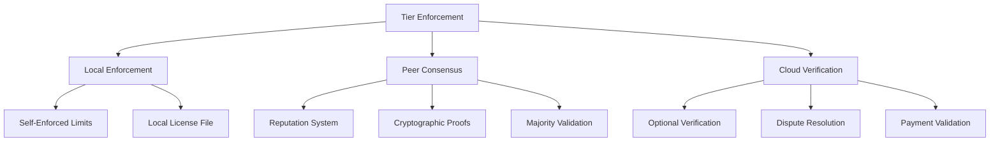

# Tier Enforcement Mechanisms in P2P Architecture

**Date**: 2025-08-20  
**Purpose**: Design enforcement mechanisms for tier limits in decentralized P2P system  
**Context**: Enforcing Personal (3 topics), Professional (AI), Business (web/mobile), Enterprise (self-hosting)  

## Executive Summary

MessagePedia implements a **hybrid enforcement model** combining cryptographic proofs, peer consensus, and optional cloud verification to enforce tier restrictions while maintaining P2P principles. The system uses **progressive trust degradation** rather than hard blocks, allowing the network to self-regulate.

## Core Enforcement Challenges

### The Fundamental Problem
```
P2P System: No central authority to enforce rules
Tier System: Requires enforcing limits (3 topics, AI access, etc.)
Tension: How to enforce without centralization?
```

### Specific Enforcement Requirements
1. **Personal Tier**: Limit to 3 owned topics
2. **Professional+**: Enable AI features
3. **Business+**: Allow web/mobile access
4. **Enterprise**: Enable self-hosting and admin features

## Enforcement Architecture

### Three-Layer Enforcement Model



## Layer 1: Local Enforcement (Honest Node Assumption)

### Self-Enforcing Client
```javascript
class LocalTierEnforcement {
  constructor() {
    this.db = new Database('tier-enforcement.db');
    this.initializeSchema();
  }
  
  initializeSchema() {
    this.db.exec(`
      CREATE TABLE IF NOT EXISTS user_tier (
        user_id TEXT PRIMARY KEY,
        tier TEXT NOT NULL,
        topic_count INTEGER DEFAULT 0,
        tier_proof TEXT,
        last_verified DATETIME,
        expires_at DATETIME
      );
      
      CREATE TABLE IF NOT EXISTS owned_topics (
        topic_id TEXT PRIMARY KEY,
        owner_id TEXT,
        created_at DATETIME,
        is_archived BOOLEAN DEFAULT FALSE
      );
    `);
  }
  
  async canCreateTopic(userId) {
    const userTier = this.getUserTier(userId);
    
    if (userTier.tier === 'personal') {
      const ownedTopics = this.db.prepare(`
        SELECT COUNT(*) as count 
        FROM owned_topics 
        WHERE owner_id = ? AND is_archived = FALSE
      `).get(userId);
      
      if (ownedTopics.count >= 3) {
        // Honest node self-blocks
        this.showUpgradePrompt();
        return false;
      }
    }
    
    return true;
  }
  
  showUpgradePrompt() {
    // Show UI to upgrade to Professional
    dialog.showMessageBox({
      type: 'info',
      title: 'Topic Limit Reached',
      message: 'You have reached the 3-topic limit for Personal tier.',
      detail: 'Upgrade to Professional ($6/month) for unlimited topics and AI features.',
      buttons: ['Upgrade Now', 'Later']
    }).then(result => {
      if (result.response === 0) {
        this.openUpgradeFlow();
      }
    });
  }
  
  // Feature gating for AI
  async canUseAI(userId) {
    const userTier = this.getUserTier(userId);
    return ['professional', 'business', 'enterprise'].includes(userTier.tier);
  }
  
  // Disable AI features in UI for Personal tier
  disableAIFeatures() {
    const aiButtons = document.querySelectorAll('.ai-feature');
    aiButtons.forEach(btn => {
      btn.disabled = true;
      btn.title = 'AI features require Professional tier';
    });
  }
}
```

### Local License File (Signed by Cloud)
```javascript
class LocalLicenseManager {
  async storeLicense(licenseData) {
    // License signed by MessagePedia cloud service
    const license = {
      userId: licenseData.userId,
      tier: licenseData.tier,
      features: licenseData.features,
      issuedAt: licenseData.issuedAt,
      expiresAt: licenseData.expiresAt,
      signature: licenseData.signature // Cryptographic signature
    };
    
    // Verify signature before storing
    if (!this.verifyLicenseSignature(license)) {
      throw new Error('Invalid license signature');
    }
    
    // Store encrypted locally
    const encrypted = await this.encryptLicense(license);
    await this.saveToSecureStorage(encrypted);
    
    return license;
  }
  
  verifyLicenseSignature(license) {
    const publicKey = this.getMessagePediaPublicKey();
    const verifier = crypto.createVerify('SHA256');
    
    verifier.update(JSON.stringify({
      userId: license.userId,
      tier: license.tier,
      features: license.features,
      issuedAt: license.issuedAt,
      expiresAt: license.expiresAt
    }));
    
    return verifier.verify(publicKey, license.signature, 'hex');
  }
  
  async checkLicenseValidity() {
    const license = await this.getStoredLicense();
    
    // Check expiration
    if (new Date(license.expiresAt) < new Date()) {
      // License expired, attempt renewal
      return await this.renewLicense();
    }
    
    // Check signature still valid
    if (!this.verifyLicenseSignature(license)) {
      // License tampered with
      this.handleTamperedLicense();
      return false;
    }
    
    return true;
  }
}
```

## Layer 2: Peer Consensus Enforcement

### Distributed Verification Network
```javascript
class PeerConsensusEnforcement {
  constructor() {
    this.peers = new Map();
    this.violations = new Map();
    this.reputationScores = new Map();
  }
  
  // When user tries to create 4th topic
  async validateTopicCreation(userId, topicId) {
    // Broadcast to peers for validation
    const validationRequest = {
      type: 'VALIDATE_TOPIC_CREATION',
      userId: userId,
      topicId: topicId,
      timestamp: Date.now(),
      requestId: crypto.randomUUID()
    };
    
    const responses = await this.broadcastValidationRequest(validationRequest);
    return this.evaluateConsensus(responses);
  }
  
  async broadcastValidationRequest(request) {
    const peers = Array.from(this.peers.values());
    const responsePromises = peers.map(peer => 
      this.requestValidation(peer, request)
    );
    
    // Wait for responses with timeout
    const responses = await Promise.allSettled(
      responsePromises.map(p => 
        Promise.race([p, this.timeout(5000)])
      )
    );
    
    return responses
      .filter(r => r.status === 'fulfilled')
      .map(r => r.value);
  }
  
  async requestValidation(peer, request) {
    // Each peer checks their local record
    return new Promise((resolve) => {
      peer.send({
        type: 'VALIDATION_REQUEST',
        request: request
      });
      
      peer.once('validation_response', (response) => {
        resolve({
          peerId: peer.id,
          approved: response.approved,
          evidence: response.evidence,
          signature: response.signature
        });
      });
    });
  }
  
  evaluateConsensus(responses) {
    // Count approvals and denials
    const approvals = responses.filter(r => r.approved).length;
    const denials = responses.filter(r => !r.approved).length;
    
    // Require 2/3 majority for approval
    const threshold = Math.ceil(responses.length * 0.67);
    
    if (approvals >= threshold) {
      return { approved: true, confidence: approvals / responses.length };
    }
    
    // Topic creation denied by peers
    if (denials >= threshold) {
      // Record violation
      this.recordViolation(request.userId, 'TIER_LIMIT_VIOLATION', {
        attemptedTopicId: request.topicId,
        currentTopicCount: responses[0]?.evidence?.topicCount,
        peerConsensus: denials / responses.length
      });
      
      return { approved: false, reason: 'Peer consensus: tier limit exceeded' };
    }
    
    // No consensus - fall back to cloud verification
    return { approved: null, reason: 'No peer consensus', requiresCloudVerification: true };
  }
}
```

### Reputation-Based Trust System
```javascript
class ReputationEnforcement {
  constructor() {
    this.db = new Database('reputation.db');
    this.initializeReputationSchema();
  }
  
  initializeReputationSchema() {
    this.db.exec(`
      CREATE TABLE IF NOT EXISTS peer_reputation (
        peer_id TEXT PRIMARY KEY,
        trust_score REAL DEFAULT 1.0,
        total_validations INTEGER DEFAULT 0,
        correct_validations INTEGER DEFAULT 0,
        tier_violations INTEGER DEFAULT 0,
        last_violation DATETIME,
        is_banned BOOLEAN DEFAULT FALSE
      );
      
      CREATE TABLE IF NOT EXISTS violation_evidence (
        id INTEGER PRIMARY KEY AUTOINCREMENT,
        violator_id TEXT,
        violation_type TEXT,
        evidence TEXT,
        reported_by TEXT,
        confirmed_by_count INTEGER DEFAULT 1,
        timestamp DATETIME DEFAULT CURRENT_TIMESTAMP
      );
    `);
  }
  
  recordViolation(peerId, violationType, evidence) {
    // Log the violation
    const stmt = this.db.prepare(`
      INSERT INTO violation_evidence (violator_id, violation_type, evidence, reported_by)
      VALUES (?, ?, ?, ?)
    `);
    
    const violationId = stmt.run(
      peerId, 
      violationType, 
      JSON.stringify(evidence),
      this.myPeerId
    ).lastInsertRowid;
    
    // Update reputation score
    this.updateReputationScore(peerId, violationType);
    
    // Broadcast violation to network
    this.broadcastViolation({
      violationId: violationId,
      violatorId: peerId,
      type: violationType,
      evidence: evidence,
      reporterId: this.myPeerId,
      timestamp: Date.now()
    });
    
    return violationId;
  }
  
  updateReputationScore(peerId, violationType) {
    const penalties = {
      'TIER_LIMIT_VIOLATION': 0.1,      // -10% trust
      'INVALID_TIER_CLAIM': 0.2,        // -20% trust
      'TAMPERED_LICENSE': 0.5,          // -50% trust
      'FALSE_VALIDATION': 0.3,          // -30% trust
      'SPAM_BEHAVIOR': 0.15             // -15% trust
    };
    
    const penalty = penalties[violationType] || 0.1;
    
    this.db.prepare(`
      UPDATE peer_reputation 
      SET trust_score = MAX(0.1, trust_score * ?),
          tier_violations = tier_violations + 1,
          last_violation = CURRENT_TIMESTAMP
      WHERE peer_id = ?
    `).run(1 - penalty, peerId);
    
    // Check if peer should be banned
    const reputation = this.db.prepare(`
      SELECT trust_score, tier_violations 
      FROM peer_reputation 
      WHERE peer_id = ?
    `).get(peerId);
    
    if (reputation.trust_score < 0.2 || reputation.tier_violations > 10) {
      this.banPeer(peerId);
    }
  }
  
  banPeer(peerId) {
    // Mark as banned in database
    this.db.prepare(`
      UPDATE peer_reputation 
      SET is_banned = TRUE 
      WHERE peer_id = ?
    `).run(peerId);
    
    // Disconnect from peer
    this.disconnectPeer(peerId);
    
    // Broadcast ban to network
    this.broadcastBan(peerId);
  }
  
  // Gradual trust recovery for good behavior
  recordGoodBehavior(peerId) {
    this.db.prepare(`
      UPDATE peer_reputation 
      SET trust_score = MIN(1.0, trust_score * 1.01),
          correct_validations = correct_validations + 1,
          total_validations = total_validations + 1
      WHERE peer_id = ?
    `).run(peerId);
  }
}
```

## Layer 3: Optional Cloud Verification

### Cloud Verification Service (Fallback)
```javascript
class CloudVerificationService {
  constructor() {
    this.apiEndpoint = 'https://api.messagepedia.com/v1/tier';
  }
  
  // Only called when peer consensus fails
  async verifyTierClaim(userId, claimedTier) {
    try {
      const response = await fetch(`${this.apiEndpoint}/verify`, {
        method: 'POST',
        headers: {
          'Content-Type': 'application/json',
          'X-User-Id': userId
        },
        body: JSON.stringify({
          userId: userId,
          claimedTier: claimedTier,
          timestamp: Date.now()
        })
      });
      
      const verification = await response.json();
      
      // Cloud returns signed verification
      return {
        valid: verification.valid,
        actualTier: verification.actualTier,
        topicCount: verification.topicCount,
        signature: verification.signature,
        validUntil: verification.validUntil
      };
      
    } catch (error) {
      // Cloud verification failed - default to peer consensus
      console.warn('Cloud verification unavailable:', error);
      return null;
    }
  }
  
  // Generate cryptographic proof of tier
  async requestTierAttestation(userId, tier) {
    const response = await fetch(`${this.apiEndpoint}/attestation`, {
      method: 'POST',
      headers: {
        'Authorization': `Bearer ${this.authToken}`,
        'Content-Type': 'application/json'
      },
      body: JSON.stringify({
        userId: userId,
        tier: tier
      })
    });
    
    const attestation = await response.json();
    
    // Attestation can be shared with peers
    return {
      userId: userId,
      tier: tier,
      issuedAt: attestation.issuedAt,
      expiresAt: attestation.expiresAt,
      signature: attestation.signature, // Signed by MessagePedia
      publicKey: attestation.publicKey  // For verification
    };
  }
}
```

## Specific Tier Enforcement Strategies

### 1. Personal Tier: 3-Topic Limit Enforcement

```javascript
class TopicLimitEnforcement {
  constructor() {
    this.myTopics = new Map();
    this.peerTopicCounts = new Map();
  }
  
  async enforceTopicLimit(userId, attemptedAction) {
    // Step 1: Local check
    const localCount = this.getLocalTopicCount(userId);
    if (localCount >= 3 && this.getUserTier(userId) === 'personal') {
      
      // Step 2: Peer verification
      const peerCounts = await this.queryPeersForTopicCount(userId);
      const consensusCount = this.calculateConsensusCount(peerCounts);
      
      if (consensusCount >= 3) {
        // Step 3: Enforce limit
        this.blockTopicCreation(userId);
        
        // Step 4: Report if violation attempted
        if (attemptedAction === 'CREATE_TOPIC') {
          this.reportTierViolation(userId, {
            type: 'TOPIC_LIMIT_EXCEEDED',
            currentCount: consensusCount,
            limit: 3
          });
        }
        
        return false;
      }
    }
    
    return true;
  }
  
  calculateConsensusCount(peerCounts) {
    // Use median to avoid manipulation
    const counts = Object.values(peerCounts).sort((a, b) => a - b);
    const mid = Math.floor(counts.length / 2);
    
    if (counts.length % 2 === 0) {
      return (counts[mid - 1] + counts[mid]) / 2;
    }
    
    return counts[mid];
  }
  
  // Track topic ownership changes
  async onTopicCreated(topicId, ownerId) {
    // Update local count
    const currentCount = this.myTopics.get(ownerId)?.size || 0;
    if (!this.myTopics.has(ownerId)) {
      this.myTopics.set(ownerId, new Set());
    }
    this.myTopics.get(ownerId).add(topicId);
    
    // Broadcast to peers
    await this.broadcastTopicOwnership({
      type: 'TOPIC_CREATED',
      topicId: topicId,
      ownerId: ownerId,
      newCount: currentCount + 1,
      timestamp: Date.now()
    });
  }
  
  async onTopicDeleted(topicId, ownerId) {
    // Update local count
    if (this.myTopics.has(ownerId)) {
      this.myTopics.get(ownerId).delete(topicId);
    }
    
    // Broadcast to peers
    await this.broadcastTopicOwnership({
      type: 'TOPIC_DELETED',
      topicId: topicId,
      ownerId: ownerId,
      newCount: this.myTopics.get(ownerId)?.size || 0,
      timestamp: Date.now()
    });
  }
}
```

### 2. Professional Tier: AI Feature Gating

```javascript
class AIFeatureEnforcement {
  constructor() {
    this.aiModelsPath = path.join(app.getPath('userData'), 'ai-models');
    this.licenseValidator = new LicenseValidator();
  }
  
  async enableAIFeatures(userId) {
    // Step 1: Verify tier
    const tier = await this.verifyUserTier(userId);
    
    if (!['professional', 'business', 'enterprise'].includes(tier)) {
      return {
        enabled: false,
        reason: 'AI features require Professional tier or higher'
      };
    }
    
    // Step 2: Download AI models (if not present)
    if (!this.areAIModelsInstalled()) {
      const license = await this.licenseValidator.getCurrentLicense();
      
      if (!license || !this.licenseValidator.validateLicense(license)) {
        return {
          enabled: false,
          reason: 'Valid license required to download AI models'
        };
      }
      
      await this.downloadAIModels(license);
    }
    
    // Step 3: Initialize AI features
    await this.initializeAI();
    
    return { enabled: true };
  }
  
  async downloadAIModels(license) {
    // Models are signed and encrypted
    const modelManifest = await this.fetchModelManifest(license);
    
    for (const model of modelManifest.models) {
      // Verify model signature
      if (!this.verifyModelSignature(model)) {
        throw new Error('Invalid model signature');
      }
      
      // Download encrypted model
      const encryptedModel = await this.downloadModel(model.url);
      
      // Decrypt with license key
      const decryptedModel = await this.decryptModel(encryptedModel, license.key);
      
      // Save locally
      await this.saveModel(model.name, decryptedModel);
    }
  }
  
  // Runtime AI access control
  async executeAISummarization(content, userId) {
    // Check tier on every AI call
    const canUseAI = await this.canUserAccessAI(userId);
    
    if (!canUseAI) {
      throw new Error('AI access denied: Upgrade to Professional tier');
    }
    
    // Check for valid license
    const license = await this.licenseValidator.getCurrentLicense();
    if (!license || new Date(license.expiresAt) < new Date()) {
      throw new Error('AI access denied: License expired');
    }
    
    // Execute AI locally
    return await this.runLocalAI(content);
  }
}
```

### 3. Business Tier: Web/Mobile Access Control

```javascript
class WebMobileAccessEnforcement {
  constructor() {
    this.contentServiceUrl = 'https://content.messagepedia.com';
  }
  
  // Content Service validates tier server-side
  async authenticateWebAccess(authToken) {
    const response = await fetch(`${this.contentServiceUrl}/auth/validate`, {
      method: 'POST',
      headers: {
        'Authorization': `Bearer ${authToken}`,
        'Content-Type': 'application/json'
      }
    });
    
    const validation = await response.json();
    
    if (!['business', 'enterprise'].includes(validation.tier)) {
      throw new Error('Web/Mobile access requires Business tier or higher');
    }
    
    // Generate session token for Content Service
    return {
      sessionToken: validation.sessionToken,
      validUntil: validation.validUntil,
      allowedFeatures: validation.features
    };
  }
  
  // Desktop app creates bridge token for web/mobile
  async generateContentBridgeToken(userId) {
    const tier = await this.getUserTier(userId);
    
    if (!['business', 'enterprise'].includes(tier)) {
      return null; // No bridge token for lower tiers
    }
    
    // Create signed token for Content Service
    const bridgeToken = {
      userId: userId,
      tier: tier,
      desktopPeerId: this.myPeerId,
      issuedAt: Date.now(),
      expiresAt: Date.now() + (24 * 60 * 60 * 1000), // 24 hours
      capabilities: this.getTierCapabilities(tier)
    };
    
    // Sign with desktop peer's private key
    bridgeToken.signature = await this.signBridgeToken(bridgeToken);
    
    return bridgeToken;
  }
}
```

### 4. Enterprise Tier: Self-Hosting Enablement

```javascript
class EnterpriseFeatureEnforcement {
  constructor() {
    this.enterpriseLicenseManager = new EnterpriseLicenseManager();
  }
  
  async enableEnterpriseFeatures(organizationId) {
    // Verify enterprise license
    const license = await this.enterpriseLicenseManager.validateLicense(organizationId);
    
    if (!license || license.tier !== 'enterprise') {
      return {
        enabled: false,
        reason: 'Valid enterprise license required'
      };
    }
    
    // Enable enterprise-specific features
    const features = {
      selfHosting: true,
      adminConsole: true,
      ssoIntegration: true,
      unlimitedUsers: license.userLimit === null,
      customization: license.features.includes('whiteLabel'),
      prioritySupport: true
    };
    
    // Generate enterprise configuration
    const config = await this.generateEnterpriseConfig(organizationId, license);
    
    return {
      enabled: true,
      features: features,
      config: config
    };
  }
  
  // Admin Console access control
  async authenticateAdminAccess(userId, organizationId) {
    // Check if user is admin
    const isAdmin = await this.checkAdminRole(userId, organizationId);
    
    if (!isAdmin) {
      throw new Error('Admin access denied');
    }
    
    // Verify enterprise license
    const license = await this.enterpriseLicenseManager.validateLicense(organizationId);
    
    if (!license || license.tier !== 'enterprise') {
      throw new Error('Enterprise license required for admin console');
    }
    
    // Generate admin session
    return {
      adminToken: await this.generateAdminToken(userId, organizationId),
      permissions: await this.getAdminPermissions(userId),
      validUntil: Date.now() + (8 * 60 * 60 * 1000) // 8 hours
    };
  }
}
```

## Enforcement Failure Handling

### Graceful Degradation Strategy
```javascript
class EnforcementFailureHandler {
  handleEnforcementFailure(failureType, context) {
    switch(failureType) {
      case 'PEER_CONSENSUS_TIMEOUT':
        // Fall back to local enforcement only
        return this.enforceLocally(context);
        
      case 'CLOUD_VERIFICATION_UNAVAILABLE':
        // Use cached verification + peer consensus
        return this.useCachedVerification(context);
        
      case 'LICENSE_EXPIRED':
        // Grace period with warnings
        return this.enterGracePeriod(context);
        
      case 'REPUTATION_TOO_LOW':
        // Quarantine mode - limited features
        return this.enterQuarantineMode(context);
        
      case 'TAMPERING_DETECTED':
        // Report and disconnect
        return this.handleTampering(context);
        
      default:
        // Log and continue with restrictions
        return this.applyDefaultRestrictions(context);
    }
  }
  
  enterGracePeriod(context) {
    const gracePeriodDays = 7;
    
    // Allow continued access with warnings
    this.showWarning(`Your ${context.tier} subscription has expired. 
                     You have ${gracePeriodDays} days to renew.`);
    
    // Restrict some features
    return {
      allowAccess: true,
      restrictions: ['no_new_topics', 'no_ai_features'],
      expiresAt: Date.now() + (gracePeriodDays * 24 * 60 * 60 * 1000)
    };
  }
  
  enterQuarantineMode(context) {
    // Low reputation users get limited access
    return {
      allowAccess: true,
      restrictions: [
        'no_topic_creation',
        'no_file_sharing',
        'read_only_mode'
      ],
      requiresReputationRecovery: true,
      minimumScoreRequired: 0.5
    };
  }
}
```

## Implementation Priority and Complexity

### Enforcement Implementation Phases

**Phase 1: Local Enforcement (Simple)**
- Local tier tracking
- UI-based feature gating
- Honor system with upgrade prompts
- **Complexity**: Low
- **Time**: 1 week

**Phase 2: Peer Consensus (Medium)**
- Topic count broadcasting
- Peer validation requests
- Basic reputation system
- **Complexity**: Medium
- **Time**: 2-3 weeks

**Phase 3: Cryptographic Proofs (Complex)**
- Signed tier attestations
- License file management
- Signature verification
- **Complexity**: High
- **Time**: 2-3 weeks

**Phase 4: Cloud Verification (Optional)**
- Fallback verification API
- Payment validation
- Dispute resolution
- **Complexity**: Medium
- **Time**: 1-2 weeks

## Security Considerations

### Attack Vectors and Mitigations

**Attack**: Modified client removes tier checks  
**Mitigation**: Peer consensus rejects invalid operations

**Attack**: Sybil attack with fake peers  
**Mitigation**: Reputation system + proof of work for new peers

**Attack**: License file tampering  
**Mitigation**: Cryptographic signatures + periodic re-validation

**Attack**: Man-in-the-middle on verification  
**Mitigation**: TLS + certificate pinning for cloud APIs

**Attack**: Reputation manipulation  
**Mitigation**: Slow reputation recovery + multiple violation sources required

## Conclusion

The tier enforcement system uses a **progressive trust model** where:

1. **Honest nodes** self-enforce (majority case)
2. **Peer consensus** catches violations (community enforcement)
3. **Reputation system** discourages cheating (social pressure)
4. **Cloud verification** resolves disputes (optional fallback)

This maintains P2P principles while providing reasonable tier enforcement. The system is **resilient to individual bad actors** but assumes the majority of the network is honest.

---

**Status**: Comprehensive enforcement design complete  
**Key Innovation**: Hybrid P2P + optional cloud verification  
**Implementation Complexity**: Phased approach from simple to complex