# WebRTC Connection Flow Documentation

**Date**: 2025-08-11  
**Purpose**: Detailed WebRTC connection establishment and P2P communication flows  
**Context**: Technical reference for MessagePedia WebRTC implementation

## Executive Summary

This document provides comprehensive visual documentation of WebRTC connection flows, peer discovery, signaling protocols, and data transfer patterns for the MessagePedia implementation.

## WebRTC Connection Establishment

### **Complete Connection Flow**

```mermaid
sequenceDiagram
    participant Alice as Alice<br/>(Initiator)
    participant SignalServer as Signaling Server<br/>(Node.js + Socket.io)
    participant Bob as Bob<br/>(Responder)
    participant STUNServer as STUN Server<br/>(Public Internet)
    participant TURNServer as TURN Server<br/>(Relay Fallback)
    
    Note over Alice,Bob: Phase 1: Room Setup & Peer Discovery
    Alice->>SignalServer: Join room "project-collaboration"
    Bob->>SignalServer: Join room "project-collaboration"
    SignalServer->>Alice: Room joined successfully
    SignalServer->>Bob: Room joined successfully
    SignalServer->>Alice: Peer discovered: Bob (peer-id: bob-123)
    SignalServer->>Bob: Peer discovered: Alice (peer-id: alice-456)
    
    Note over Alice,Bob: Phase 2: WebRTC Initialization
    Alice->>Alice: Create RTCPeerConnection
    Alice->>Alice: Add data channels (messages, files)
    Alice->>STUNServer: Gather ICE candidates
    STUNServer->>Alice: Return public IP candidates
    
    Bob->>Bob: Create RTCPeerConnection  
    Bob->>Bob: Prepare for incoming channels
    Bob->>STUNServer: Gather ICE candidates
    STUNServer->>Bob: Return public IP candidates
    
    Note over Alice,Bob: Phase 3: SDP Offer/Answer Exchange
    Alice->>Alice: Create SDP Offer
    Alice->>SignalServer: Send offer to Bob
    SignalServer->>Bob: Forward SDP offer
    
    Bob->>Bob: Set remote description (Alice's offer)
    Bob->>Bob: Create SDP Answer
    Bob->>SignalServer: Send answer to Alice
    SignalServer->>Alice: Forward SDP answer
    Alice->>Alice: Set remote description (Bob's answer)
    
    Note over Alice,Bob: Phase 4: ICE Candidate Exchange
    Alice->>SignalServer: Send ICE candidates
    SignalServer->>Bob: Forward ICE candidates
    Bob->>SignalServer: Send ICE candidates  
    SignalServer->>Alice: Forward ICE candidates
    
    Note over Alice,Bob: Phase 5: Connection Establishment
    Alice<-->Bob: ICE connectivity checks
    
    alt Direct P2P Connection Successful
        Alice<-->Bob: Direct P2P connection established
        Note over Alice,Bob: Optimal: Direct peer-to-peer communication
    else NAT Traversal Required
        Alice->>TURNServer: Request relay connection
        TURNServer->>Alice: Relay allocated
        Bob->>TURNServer: Connect through relay
        Alice<-->TURNServer<-->Bob: Relayed connection established
        Note over Alice,Bob: Fallback: Communication via TURN relay
    end
    
    Note over Alice,Bob: Phase 6: Data Channel Setup
    Alice->>Bob: Data channel "messages" ready
    Bob->>Alice: Data channel "messages" ready
    Alice->>Bob: Data channel "files" ready
    Bob->>Alice: Data channel "files" ready
    
    Note over Alice,Bob: Phase 7: Application-Level Communication
    Alice->>Bob: Send message: "Hello Bob!"
    Bob->>Alice: Send message: "Hi Alice!"
    Alice->>Bob: Send file: document.pdf (2.5MB)
    Bob->>Alice: File received successfully
```

## Peer Discovery & Room Management

### **Signaling Server Architecture**


## File Transfer Protocol

### **Large File Transfer Flow**

```mermaid
sequenceDiagram
    participant Alice as Alice<br/>(Sender)
    participant DataChannel as WebRTC<br/>Data Channel
    participant Bob as Bob<br/>(Receiver)
    
    Note over Alice,Bob: File Transfer Initiation
    Alice->>Alice: Select file: video.mp4 (150MB)
    Alice->>Alice: Calculate chunks: 2,400 × 64KB
    Alice->>Alice: Generate file hash (SHA-256)
    
    Alice->>DataChannel: File metadata
    Note right of DataChannel: {<br/>  type: "file-start",<br/>  name: "video.mp4",<br/>  size: 157286400,<br/>  chunks: 2400,<br/>  hash: "a1b2c3..."<br/>}
    DataChannel->>Bob: Forward metadata
    
    Bob->>Bob: Prepare file buffer
    Bob->>DataChannel: Transfer accepted
    DataChannel->>Alice: Acceptance confirmed
    
    Note over Alice,Bob: Chunked Transfer Process
    loop For each chunk (1 to 2400)
        Alice->>Alice: Read chunk from file
        Alice->>DataChannel: Send chunk data
        Note right of DataChannel: {<br/>  type: "file-chunk",<br/>  index: N,<br/>  data: ArrayBuffer,<br/>  checksum: "xyz..."<br/>}
        DataChannel->>Bob: Forward chunk
        
        Bob->>Bob: Verify chunk checksum
        Bob->>Bob: Write chunk to buffer
        Bob->>DataChannel: Chunk received (ACK)
        DataChannel->>Alice: Forward ACK
        
        Alice->>Alice: Update progress (N/2400)
        Bob->>Bob: Update progress (N/2400)
    end
    
    Note over Alice,Bob: Transfer Completion
    Alice->>DataChannel: Transfer complete
    DataChannel->>Bob: Transfer complete signal
    
    Bob->>Bob: Verify complete file hash
    Bob->>Bob: Save file to disk
    Bob->>DataChannel: File verified & saved
    DataChannel->>Alice: Success confirmation
    
    Alice->>Alice: Update UI: Transfer complete
    Bob->>Bob: Update UI: File received
```



### **Multi-Peer File Distribution**

```mermaid
flowchart TB
    A[Alice Has File<br/>📄 presentation.pptx<br/>25MB] --> B[Multiple Recipients<br/>👥 Bob, Carol, Dave]
    
    B --> C{Distribution Strategy}
    C -->|Sequential| D[One-by-One Transfer]
    C -->|Parallel| E[Simultaneous Transfer]
    C -->|Hybrid| F[Torrent-Style Distribution]
    
    D --> D1[Send to Bob]
    D1 --> D2[Send to Carol]
    D2 --> D3[Send to Dave]
    D3 --> G[All Transfers Complete]
    
    E --> E1[Send to Bob<br/>🔄 Parallel Stream 1]
    E --> E2[Send to Carol<br/>🔄 Parallel Stream 2] 
    E --> E3[Send to Dave<br/>🔄 Parallel Stream 3]
    E1 --> G
    E2 --> G
    E3 --> G
    
    F --> F1[Send first chunk to Bob]
    F1 --> F2[Bob forwards to Carol]
    F2 --> F3[Carol forwards to Dave]
    F3 --> F4[Alice sends next chunk to Carol]
    F4 --> F5[Distributed Chunk Sharing]
    F5 --> G
    
    G --> H[Update All UIs<br/>✅ Distribution Complete]
    
    style A fill:#e3f2fd
    style G fill:#e8f5e8
    style H fill:#fff3e0
```



## Connection State Management

### **Connection Lifecycle**


## Error Handling & Recovery

### **Connection Recovery Strategies**


## Performance Monitoring

### **Connection Quality Metrics**


## Implementation Checklist

### **WebRTC Integration Requirements**

- [x] **RTCPeerConnection Setup** ✅
  - [x] STUN/TURN server configuration
  - [x] ICE candidate gathering
  - [x] Connection state monitoring

- [x] **Data Channel Implementation** ✅  
  - [x] Message channel (reliable, ordered)
  - [x] File transfer channel (reliable, ordered)
  - [x] Presence channel (unreliable, fast)

- [ ] **Signaling Server** 🔄
  - [x] Socket.io server setup
  - [x] Room management
  - [ ] Scalability optimization

- [ ] **Error Handling** 🔄
  - [x] Connection failure recovery
  - [x] Network change adaptation
  - [ ] Advanced failure scenarios

- [ ] **Performance Optimization** 🔄
  - [ ] Adaptive bitrate control
  - [ ] Connection quality monitoring
  - [ ] Bandwidth optimization

## Security Considerations

### **WebRTC Security Model**


**Security Features:**
- **End-to-End Encryption**: All WebRTC traffic encrypted with DTLS
- **Identity Verification**: Peer authentication via signaling server
- **Secure Signaling**: HTTPS/WSS for signaling communications
- **ICE Security**: Authenticated STUN/TURN server access

---

**Implementation Status**: 75% Complete  
**Next Milestone**: Multi-peer file distribution testing  
**Documentation**: Auto-generated from WebRTC implementation